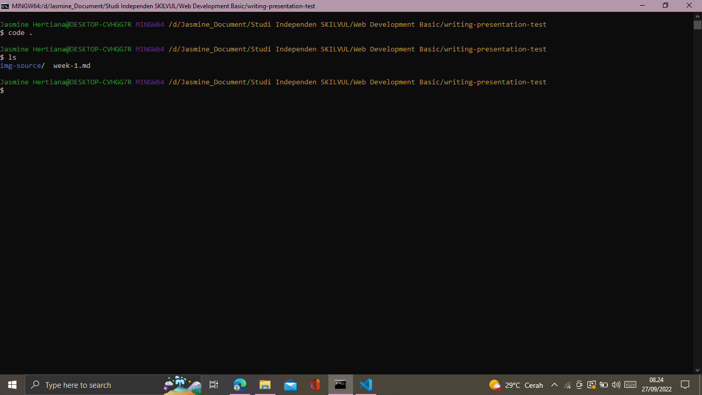
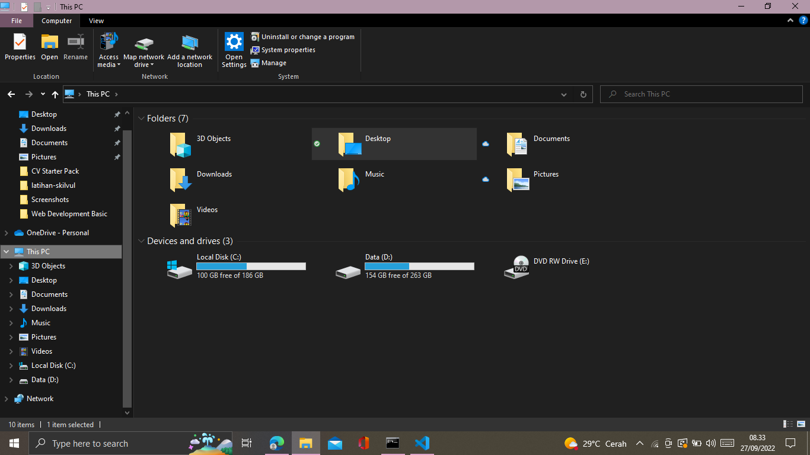
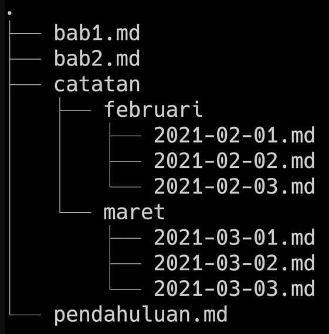
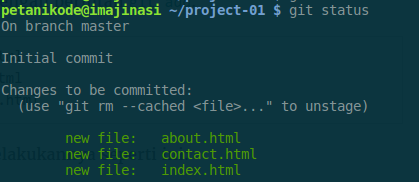
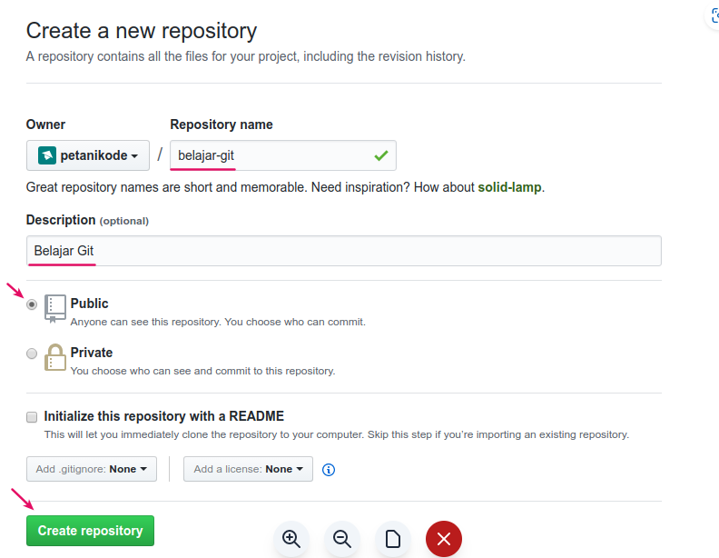
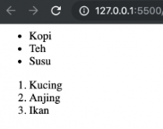
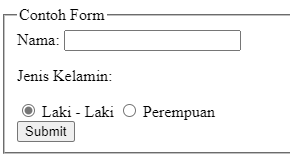
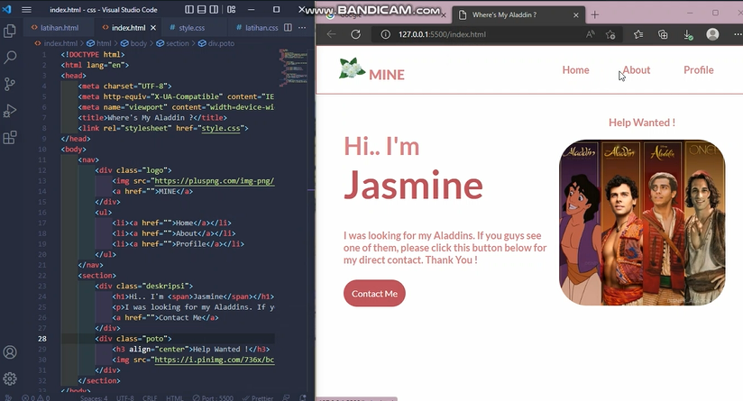
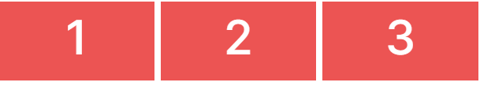

# **Writing Week 1**
## **Unix Command Line**
- ### **Shell**
  <div align="justify">User memerlukan yang namanya shell karena Shell adalah program yang menerima perintah, kemudian meneruskan perintah tersebut ke system untuk dieksekusi. Tujuannya agar user dapat terhubung dan berinteraksi serta memberikan perintah dengan komputer.
- ### **Terminal**
  <div align="justify">User dan komputer dihubungkan dengan terminal, yaitu tempat dimana user dapat mengetikan atau memberikan suatu perintah. contoh terminal emulator untuk mengakses shell :

  - sh
  - bash
  - zsh
  - cmd.exe

- ### **Command Line Interface**
  <div align="justify">CLI merupakan shell berbasis teks seperti gambar berikut :

  
- ### **Graphic User Interface**
  <div align="justify">GUI merupakan shell berbasis grafis seperti gambar berikut :
  
  
- ### **File System Structure**
  <div align="justify">Struktur sistem file yang mengatur cara bagaimana data atau file disimpan dalam sebuah sistem direktori. Contoh struktur file yang disimpan menggunakan struktur yang bentuknya mirip sebuah pohon seperti gambar dibawah :
  
  
- ### **Cara Akses CLI dengan Terminal**
  <div align="justify">pertama, buka terminal lalu sesuaikan dengan pathname yang ingin dieksekusi:

  - Contoh Absolute Pathname
  
  ``` /Users/user/Work/GitHub/skilvul/tugas ```
  - Contoh Relative Pathname

  ``` ./img-source/file.php ```

- ### **Command Line pada Bash**
  - ### **pwd**
    <div align="justify">

    *print working directory* untuk melihat nama direktori kita berada saat ini, contoh :
    
    ``` 
    $ pwd
    
    /d/Jasmine_Document/Studi Independen SKILVUL/Web Development Basic/writing-presentation-test/week-1
    ```
  - ### **ls**
    <div align="justify">

    *list* untuk melihat isi dari direktori, contoh :
    
    ``` 
    $ ls
    
    img-source/  week-1.md
    ```
  - ### **cd**
    <div align="justify">

    *change directory*untuk pindah ke direktori lain, contoh :
    
    ``` 
    $ cd img-source
    ```
    untuk kembali ke direktori sebelumnya:
    ``` 
    $ cd ..
    ```
  - ### **head, tail, dan cat**
    <div align="justify">untuk melihat isi files awal (head), akhir(tail), keseluruhan(cat), contoh:
    
    ``` 
    $ head -5 week-1.md
    $ tail -5 week-1.md
    ```
    ket : akan menampilkan 5 baris awal (head) dan 5 baris akhir(tail)
  - ### **touch**
    <div align="justify">untuk membuat sebuah file, contoh:
    
    ``` 
    $ touch nama-file-baru
    ```
  - ### **mkdir**
    <div align="justify">

    *make directory* untuk membuat sebuah file, contoh:
    
    ``` 
    $ mkdir nama-folder-baru
    ```
  - ### **cp**
    <div align="justify">untuk menyalin sebuah file, cp -R untuk menyalin direktori, contoh:
    
    ``` 
    $ cp nama-file path-direktori
    $ cp -R path-direktori-salinan
    ```
  - ### **mv**
    <div align="justify">untuk memindahkan files atau directory. Bisa digunakan untuk rename:
    
    ``` 
    $ mv nama-file nama-file-baru
    $ mv nama-file path-direktori
    $ mv -R nama-folder path-direktori
    $ mv -R nama-folder nama-folder-baru
    ```
    
  - ### **rm**
    <div align="justify">untuk menghapus file, “rm -R” atau “rm -d” untuk menghapus directory, "rm -rf" untuk menghapus direktori termasuk file hidden (force delete):
    
    ``` 
    $ rm nama-file
    $ rm -R nama-direktori
    $ rm -rf nama-direktori
    ```

&nbsp;
## **Git & GitHub Dasar**
- ### **Git**
  <div align="justify">Sebagai version contol system untuk melacak suatu perubahan yang terjadi di suatu folder ataupun file, yang biasanya digunakan oleh programmer sebagai tempat untuk menyimpan file programan mereka karena lebih efektif.
- ### **GitHub**
  <div align="justify">Merupakan salah satu penyedia layanan git  layanan hosting berbasis web sebagai repositori git dengan berbasis cloud. contoh lainnya selain github :

  - GitLab
  - BitBucket

- ### **Kenapa Git & GitHub menjadi Tools Wajib ?**
  <div align="justify">Dengan menggunakan Git dan Github, dapat mempermudah programmer bekerja dalam sebuah tim. Tujuan besarnya adalah bisa berkolaborasi mengerjakan proyek yang sama tanpa harus repot copy paste folder aplikasi yang terupdate. Serta, tidak perlu menunggu rekan dalam satu tim menyelesaikan suatu program dahulu untuk berkolaborasi. anggota tim bisa membuat file didalam projek yang sama atau membuat code di file yang sama dan menyatukannya saat sudah selesai.

  &nbsp;
- ### **Alur dan Command**
  - ### **instalasi**
    <div align="justify">setelah selesai instalasi, cek pada terminal apakah sudah terinstall dan versi berapa yang terinstal:
    
    ``` 
    $ git --version
    ```
  - ### **config**
    <div align="justify">lakukan konfigurasi:
    
    ``` 
    $ git config --global user.name "mine wa"
    $ git config --global user.email @mine.com
    ```
    cek konfigurasi
    ``` 
    $ git config --list
    ```

  - ### **init**
    <div align="justify">Membuat Repositori :
    
    ``` 
    $ git init nama-direktori
    ```
  - ### **add**
    <div align="justify">Untuk mengubah kondisi file dari modified ke staged. "git add ." staging semua file dalam direktori tsb, Contoh:
    
    ``` 
    $ git add nama-file
    $ git add .
    ```
  - ### **status**
    <div align="justify">untuk melihat status repositorinya, contoh:
    
    

  - ### **commit**
    <div align="justify">untuk mengubah kondisi file dari staged ke commited agar semua perubahan disimpan oleh Git:
    
    ``` 
    $ git commit -m "keterangan"
    ```

  - ### **log**
    <div align="justify">untuk melihat catatan log perubahan pada respositori, contoh:
    
    ``` 
    $ git log --oneline

    06f735a ditambahkan isi
    cf08ca0 commit pertama
    ```
  - ### **checkout**
    <div align="justify">mengembalikan revisi yang belum staged ataupun committed, contoh:
    
    ``` 
    $ git checkout nama_file.html
    ```
    
  - ### **reset**
    <div align="justify">Membatalkan Perubahan File yang Sudah dalam Kondisi staged, contoh:
    
    ``` 
    $ git reset nama_file.html
    ```
  - ### **revert **
    <div align="justify">Membatalkan Perubahan File yang Sudah dalam Kondisi Commited, contoh:

    ``` 
    $ git revert -n nomer-commit
    ```
  - ### **Buat Repo di GitHub**
    <div align="justify">ke laman website github dan buat repository baru, contoh:
    
    

  - ### **remote add**
    <div align="justify">kembali ke terminal, remote add untuk menambahkan remote:
    
    ```
    $ git remote add nama https://github.com/jasmine/belajar-git.git
    ```

  - ### **push**
    <div align="justify">untuk mengirim local repo ke repository remote.

    ```
    $ git push nama main
    ```

  - ### **clone**
    <div align="justify">bisa dibilang untuk copy repository dari remote ke lokal atau download remote repository.

    ```
    $ git clone https://github.com/jasmine/belajar-git.git
    ```

&nbsp;
## **HTML**
- ### **Definisi & Fungsi HTML pada Web Development**
  <div align="justify">
  
  *Hyper Text Markup Language* adalah bahasa komputer yang digunakan untuk membuat kerangka atau struktur untuk Web pages (halaman website) di internet.Fungsi HTML adalah sebagai 'kerangka', yang memberi struktur pada website.

- ### **Tools**
  <div align="justify">Tools yang dibutuhkan untuk untuk membuat HTML yaitu web browser dan code editor. Visual Studio Code merupakan salah satu code editor yang dibuat oleh Misrosoft. Keunggulan dari Visual Studio Code yaitu Intellisense, Run and Debug,Built in Git, Extensions.

- ### **Kerangka HTML**
  <div align="justify">

  ```html
  <html>
    <head>
      <title>
          Judul Website
      </title>
    <body>
      Hai.. HTML Dasar
    </body>
  </html>
  ```
  Didalam website selalu ada title untuk tiap-tiap web, untuk memasukkan title didalam web kamu harus mengetikkan diantara tag title (dapat diisikan dengan nama website kamu atau yang lainnya). Untuk memasukkan konten-konten, kamu dapat memasukkannya atau mengetikkannya didalam program tepat diantara tag body (Ganti titik-titik dengan konten).

&nbsp;
-  HTML Element terdiri atas opening tag, content, dan closing tag.
- HTML Attributes : properties dari sebuah element HTML. Contohnya yaitu id,class,name.
- HTML Comment digunakan untuk memberi keterangan pada suatu line code ```<!-- -->```

&nbsp;
- ### **HTML Tag**
  - ### **HTML Tag untuk Teks**
    <div align="justify">
    Heading

    ```html 
    <h1>Heading Satu</h1>
    ```
    Paragraf

    ```html 
    <p>
      Lorem ipsum dolor sit, amet consectetur adipisicing elit. Voluptate tempora. 
    </p>
    ```
    Link/Anchor

    ```html 
    <a href="https://google.com">Google</a>
    ```

    Span

    ```html 
    <p>Kucingku bermata <span style="color:blue"> biru</span></p>
    ```
    Ordered List & Unordered List 
    ```html 
    <!-- Unordered List -->
    <ul>
      <li>Kopi</li>
      <li>Teh/li>
      <li>Susu</li>
    </ul>
    <!-- Ordered List -->
    <ol>
      <li>Kucing</li>
      <li>Anjing</li>
      <li>Ikan</li>
    </ol>
    ```
    
  
  - ### **HTML Tag untuk Multimedia**
    <div align="justify"> 
    
    Gambar

    ```html
    
    ```
    
    Video

    ```html
    <video width="320" height="240">
      <source src="link-ke-video-nya" type="video/tipe-videonya"/>
    </video>
    ```
    Audio

    ```html
    <audio controls>
      <source src="link-ke-file-audio" type="audio/tipe-audionya" />
    </audio>
    ```
  - ### **HTML Tag untuk Tabel**
    <div align="justify"> 
    'tr' atau dikenal sebagai table row tag, digunakan untuk membuat baris baru di dalam 'table'.'td'atau dikenal sebagai table data tag.

    ```html
    <table>
      <thead>
          <tr>
            <th>Nama</th>
            <th>Nilai</th>
          </tr>
      </thead>
      <tbody>
        <tr>
            <td>Sarah</td>
            <td>10</td>
        </tr>
      </tbody>
    </table>
    ```
  - ### **HTML Tag untuk Formulir**
    <div align="justify"> 
    'tr' atau dikenal sebagai table row tag, digunakan untuk membuat baris baru di dalam 'table'.'td'atau dikenal sebagai table data tag.

    ```html
    <!DOCTYPE html>
    <html>
      <head>
        <title>Form</title>
      </head>
      <body>
        <form>
          <fieldset>
            <legend>Contoh Form</legend>
          <div>
            <label>Nama: </label>
            <input type="text" name="nama" />
          </div>
          <div>
            <p>Jenis Kelamin:</p>
            <input type="radio" name="jenis_kelamin" value="laki-laki" checked />
            <label>Laki - Laki</label>
            <input type="radio" name="jenis_kelamin" value="perempuan" />
            <label>Perempuan</label>
          </div>
          <input type="submit" value="Submit" />
          </fieldset>
        </form>  
      </body>
    </html>
    ```
    

- ### **Semantic HTML**
  <div align="justify">di HTML5, layout pada website lebih diperjelas dengan element tertentu, sehingga memudahkan programmer untuk membaca kode. Penjelasan element ini dinamakan semantic element

  ```html
  <html>
   <head>
      <title>Welcome to My Page</title>
   </head>
   <body>
      <!-- nav digunakan untuk tautan navigasi utama -->
      <nav>
         <a href="./home">Home</a>
      </nav>
      <!-- header adalah bagian tajuk dari sebuah halaman web -->
      <header>
         <h1>This is my website</h1>
      </header>
      <!-- aside adalah bagian samping konten utama -->
      <aside>
         <a href="./terms">Terms & Policy</a>
      </aside>
      <!-- article menandakan sebuah blok teks yang isinya independen terhadap element lain -->
      <article>
         <!-- section menandakan bagian dalam sebuah halaman web -->
         <section>
            Lorem Ipsum is simply dummy text of the printing and typesetting industry.
         </section>
      </article>
      <!-- footer merupakan bagian halaman web di bawah konten utama -->
      <footer>2020 Copyright</footer>
    </body>
  <html>
  ```
  &nbsp;
- ### **Preview HTML**
  <div align="justify">Salah satu cara menjalankan HTML yaitu menggunakan ekstensi "Live Server" pada vscode, langkah-langkah preview html dengan Live Server :
  
  1. #### install ekstensi live server pada vscode
  2. #### klik kanan pada file HTML dan klik Open Live Server maka akan diarahkan ke portal 5500
  3. #### coding dan tampilan akan ditampilkan secara real-time

- ### **Alur Deployment**
  <div align="justify">

  1.  sign up akun [netlify](https://app.netlify.com/signup) 
  2. Upload Website ke Netlify, menggunakan Git atau drag/drop file langsung
  3. tunggu proses deploy
  3. setelah selesai, alamat domain akan tampil, dan alamat tersebut bisa diedit.

&nbsp;

## **CSS**
- ### **Definisi CSS**
  <div align="justify">

   *Cascading Style Sheets* adalah bahasa komputer yang digunakan untuk menambahkan design ke suatu halaman website di internet. Fungsi CSS sebagai 'baju' , yang memberi warna dan layout pada website.
- ### **Menyisipkan CSS di HTML**
  <div align="justify">

  Inline CSS, yaitu menggunakan attribute style untuk menyisipkan kode CSS langsung di dalam HTML element.
  ```html
  <h1 style="color:blue;">Selamat Datang</h1>
  ```
  Internal CSS, yaitu menggunakan element style untuk menyisipkan kode CSS. Element style tersebut diletakkan di dalam element 
  ```html
  <style>
      h1 {
        background-color:deepskyblue;
      }
   </style>
  ```
  External CSS, yaitu sebuah file CSS terpisah yang disambungkan dengan file HTML dengan menggunakan element link.
   ```html
  <link rel="stylesheet" href="style.css" />
  ```

- ### **CSS Syntax**
  <div align="justify">
  syntax yang digunakan untuk menunjuk atau memilih HTML element mana yang ingin diberi style (dihias). CSS syntax terdiri dari selector, property, dan value.

  ```css
  selector {
      property: value;
    }
  ```
  ```html
  <!-- Pada file HTML -->
  <p>Hello world</p>
  ```

  ```css
  /* Pada file CSS */
  p {
    color: blue;
  }
  ```
  dibawah ini hasil styling CSS pada sebuah halaman HTML dengan metode Eksternal CSS

  &nbsp;

  

- ### **Responsive Web**

  - ### **Viewport**
    <div align="justify">viewport adalah daerah yang menampilkan halaman web yang sedang kita akses. Untuk membuat halaman website menjadi responsif, maka kita perlu menambahkan meta data berikut ini di dalam element 'head' di file HTML

    ```html
    <meta name="viewport" content="width=device-width, initial-scale=1.0" />
    ```
  - ### **Width : %**
    <div align="justify">Menggunakan Persentase Untuk Menentukan Nilai Lebar Suatu Element

    ```html
    <style>
      div{
        width: 100%;
        background-color: yellow;
      }
      img {
        width: 60%;
      }
    </style>
    ```
  - ### **max-width: 100%**
    <div align="justify">properti akan mengikuti lebar layar maksimal

    ```html
    <style>
      img {
        max-width: 100%;
        height: auto;
      }
    </style>
    ```
  - ### **vw**

    <div align="justify">1vw = 1% lebar viewport. Jika lebar viewport sebesar 100cm, maka 1vw adalah 1cm

    ```css
    h1 {
        font-size: 5vw;
      }
    ```

  - ### **media query**

    ```css
    @media (max-width: 600px)
    ```
    <div align="justify">merujuk kepada jendela browser yang lebarnya maksimal 600px. Dengan kata lain, semua rule/kode CSS di dalam @media ini akan diterapkan jika layarnya memiliki lebar 600px atau kurang.

&nbsp;
- ### **Flexbox Element**

  - container adalah element yang membungkus dan mengatur tampilan dari element di dalamnya,
  - item adalah element dalam container yang diatur tampilannya.

  ```html
    <style>
		#flex-container {
			display: flex;
			flex-direction:row;
		}
		.flex-item {
			flex-basis: 100%;
			height: 100px;
			margin: 4px;
			background: #ec5453;
			font-size: 60px;
			color: white;
			text-align: center;
		}
	  </style>
  <body>
	  <div id="flex-container">
		  <div class="flex-item">1</div>
		  <div class="flex-item">2</div>
		  <div class="flex-item">3</div>
	  </div>
  </body>
  ```
    output

    
    

  - **Justify Content**
    <div align="justify">mengatur tata letak dan ruang di antara item. Properti justify-content bisa diisi dengan satu dari beberapa nilai berikut:

    - flex-start - semua item akan ditempatkan di depan.
    - flex-end - semua item akan ditempatkan di belakang
    - center - akan memampatkan semua item ke tengah
    - space-around - akan memberi ruang pada sekitar tiap item
    - space-between - akan memberi ruang pada setiap dua item yang bersebelahan, contoh space-between:

    

&nbsp;

## **Algoritma dan Struktur Data**

- ### **Perbedaan Algoritma dan Struktur Data**

  <div align="justify">Algortima Adalah deskripsi berupa step-step yang dibutuhkan untuk menyelesaikan suatu masalah. Untuk menyelesaikan suatu masalah, tentunya kita harus mempunyai data struktur, nah data inilah yang akan kita gunakan untuk menyelesaikan suatu masalah dengan menggunakan algoritma.

  &nbsp;

- ### **Manfaat Algoritma**

  Manfaat algoritma antara lain:

  - <div align="justify">Membantu menyederhanakan suatu program yang rumit dan juga besar.
  - <div align="justify">Mempermudah pembuatan program yang dapat menyelesaikan masalah tertentu.
  - <div align="justify">Membantu menyelesaikan suatu masalah dengan logika dan juga sistematis.

  &nbsp;

- ### **Kualitas Algortima**

  Kualitas wajib dari algoritma

  - <div align="justify">Input dan output harus didefinisikan terlebih dahulu dengan tepat
  - <div align="justify">Setiap step harus benar-benar clear dan tidak ambigu
  - <div align="justify">Algoritma seharusnya tidak mengandung suatu code pada bahasa pemograman tertentu.
  - <div align="justify">Algoritma harus dibuat agar dapat digunakan dalam bahasa pemograman apapun.

    &nbsp;

- ### **Penggunaan Algortima**
  - Contoh Soal
      <div align="justify">Buatlah Algoritma untuk menyelesaikan problem ini

      David memiliki program yang membutuhkan untuk convert data dari jumlah jam ke detik

      Contohnya jika program memiliki input 2 jam maka output yang diharapkan adalah 7200 detik

  - Jawaban

      1. Mulai
      2.  Deklarasi variabel n, hasil_convert
      3. Menambahkan nilai n
      4.  <div align="justify">Melakukan proses (n jam = n \* 3600" lalu disimpan ke dalam hasil_convert
      5. Menampilkan hasil convert (n jam) = + "detik"
      6.  Stop

    &nbsp;

- ### **Pseudocode**

  <div align="justify">Pseudocode adalah menuliskan algoritma sebelum kita implementasikan ke bahasa pemograman tertentu.

  - **Menulis Pseudocode**

    - <div align="justify">Menggunakan HURUF BESAR pada kata kunci (key commands).
      CONTOH: IF number is > 10 THEN …
    - 1 statement = 1 baris
    - Gunakan indentasi
    - Simpel

    Contoh :

    ```java
    STORE "width" with any number
    STORE "height" with any nummber
    STORE "area" without any value

    CALCULATE "width" times "height"
    SET "area" value with calculation result
    DISPLAY "area"
    ```

    &nbsp;

- ### **Pseudocode berdasarkan kondisi masalah**

    - **Procedural**

      Procedural adalah cara berpikir secara runtun. Artinya serangkaian perintah yang berurutan.

      Contoh :

      ```java
      STORE "width" with any number
      STORE "height" with any nummber
      STORE "area" without any value

      CALCULATE "width" times "height"
      SET "area" value with calculation result
      DISPLAY "area"
      ```

      &nbsp;

    - **Conditional**

      Conditional digunakan saat dibutuhkan percabangan kasus. Komputer akan melakukan suatu tindakan jika suatu kondisi terpenuhi.

      Jika hari ini tidak hujan, maka Bob pergi ke pasar,

      jika tidak maka Bob dirumah aja.

      ```java
      IF "bright"
      DO "go to the market"
      ELSE
      DO "stay at home"
      ```

    &nbsp;

    - **Looping**

      Komputer dapat melakukan sebuah proses yang sama berulang-ulang. Jika membutuhkan perulangan dalam kasus tertentu, kita bisa menggunakan Looping.

      Contoh :

      ```java
      STORE "count" t0 1

      WHILE "count" < 11
      DISPLAY "count"
      CALCULATE "count" mod 2
      STORE "reminder" value with calculation result
      IF "reminder" equals to 0
      DISPLAY "EVEN!"
      ELSE
      DISPLAY "ODD!"
      ```

      &nbsp;

    - **Recursive**

      Recursive adalah pola pikir dalam algoritma yang memanggil method/function didalam sebuah function, 
      contoh :

      ```java
      //recursive function
      int Sum(int n){ 
        //base case
        if (n <= 1){
        return 1;
        }
        //general case
        else{
        return n + Sum(n-1);
        }
      }
      ```
&nbsp;
## **JavaScript Introduction**
- <div align="justify">
  
  **Javascript** merupakan bahasa pemrograman yang digunakan untuk membuat suatu website menjadi **interaktif**
- <div align="justify">
  Cara menjalankan javascript adalah melalui berbagai browser. Namun mozilla dan google chrome merupakan browser yang paling umum digunakan. 
- <div align="justify">
  
  Pada Javascript dikenal dengan istilah **Syntax** dan **Statement**
- <div align="justify">
  
  **Syntax** adalah sesuatu yang dapat diibaratkan sebagai kamus dan berperan dalam mengatur tata cara dalam bahasa pemrograman. **Syntax** digunakan untuk membuat statement program, instruksi untuk dijalankan atau dieksekusi oleh web browser dan compiler.
- Contoh Syntax Java Script 
  - Alert 
  - Prompt
  - confirm
- <div align="justify">
  
  **Console Log** adalah tempat untuk melakukan pengecekan logic pemrograman serta pemeriksaaan apakah terdapat error atau tidak pada pemrograman.
- **Comments**
  - Single Comments: `` // ``
  - Multiline Comments:  `` /* */``
- **Tipe Data** <br />
Ada 6 macam tipe data fundamaental pada javascript yaitu :
  - <div align="justify">
    
    Number : tipe data yang mengandung semua jenis angka. <br />
    Tipe data number ada 2 macam yaitu **integer** (terdiri dari bilangan bulat positif atau negatif) dan **float** (terdiri dari bilangan desimal)
  - <div align="justify">
    String : tipe data yang terdiri dari huruf, angka, spasi maupun simbol <br />
  - Boolean : tipe data yang memiliki nilai true or false
  - Null : tipe data pada sebuah data/variabel yang tidak memiliki nilai
  - Undefined : tipe data yang merepresentasikan varibel/data yang tidak memiliki nilai
  - Object : tipe data yg dapat berisi berbagai nilai dan berhubungan dengan dunia nyata
  - **Variabel** merupakan wadah atau tempat untuk menyimpan sebuah nilai
3 hal yang dapat dilakukan pada variabel:
  - variabel harus dibuat dengan nama yang jelas dan menggabarkan tentang data tersebut
  - variabel dapat menimpan dan mengupdate informasi data yang disimpan
  - variabel digunakan untuk menampilkan atau mendapatkan data yang tersimpan
- Ada 3 cara untuk mendefinisikan variabel yaitu :
  - var
  - let
  - const
- Aturan Penamaan variabel yaitu :
  <div align="justify">

  - Harus mendeskripsikan dengan jelas tentang data yang disimpan
  - Tidak bisa menggunakan angka diawal variabel 
  - Menggunakan camelcase untuk nama variabel yg lebih dari 1 kata

  &nbsp;
### **Operator**
- **Assignment Operator (=)** digunakan untuk menyimpan sebuah nilai pada variabel
 contohnya : `` let myName = 'Jasmine'``
- **Mathematical Assignment Operator**
- contohnya : 
  ```java
    let x = 10 ; 
    x *= 2 ; 
    console.log(x) // Output: 20
  ```
- **Increment dan Decrement** digunakan untuk menambah atau mengurangi sebesar 1 nilai
- contohnya :
  ```java
  let a = 10;
  a++
    console.log(a) // output: 11
  ```
- **Arithmetic Operator** digunakan apabila melibatkan operasi matematika
  - Pertambahan (+)
  - Pengurangan (-)
  - Perkalian (*)
  - Pembagian (/)
  - Modulus (%)
- **Comparism Operator** digunakan untuk membandingkan suatu nilai 
  - Lebih Besar (>)
  - Lebih Kecil (<)
  - Lebih kecil atau samadengan (<=)
  - Lebih besar atau samadengan (>=)
  - Samadengan (===)
  - Tidak Samadengan (!==)
- **Logical Operator** digunakan untuk sebuah kondisi
  - AND operator (&&)
  - OR operator (||)
  - NOT operator (!)

### **Conditional**
- **Conditional** merupakan *statement percabangan* yang menggabarkan suatu *kondisi*
- Conditional statement akan melakukan pengecekan pada kondisi fisik dan menjalankan perintah berdasarkan kondisi tersebut
- Contoh Conditional
- IF Statement
- contoh conditional **if statement** :
  - Jika cuaca hari ini cerah, maka kita akan pergi keluar
  - jika saya lapar, maka saya makan
- contoh if statement 
  ```java
  let nilai = 10;
  if (nilai === 10){
    console.log('variabel nilai yang disimpan adalah benar 10');
  }
  ```
- IF ... ELSE Statement
- contoh conditional **if else statement**
  ```java
  let angka = 12;
  if (angka %2 == 0){
    console.log(angka + " adalah angka genap");
  } else {
    console.log(angka + " adalah angka ganjil")
  }
  ```
- IF ... ELSE IF Statement
- contoh conditional **if else if statement**
  ```java
  let num1 = 10
  let num2 = 20

  if (num1 = num2){
      console.log(num1)
  } else if (num1 > num2){
      console.log(num1)
  } else {
      console.log(num2)
  }
  ```

- Switch Case Conditional digunakan jika kondisi percabangan terlalu banyak
- contoh conditional **switch case**

  ```java
	let warna = "kuning";
 
		switch (warna){
			case "hitam":
				console.log ("warna hitam");
				break;
			case "merah":
				console.log ("warna merah");
				break;
			case "hijau":
				console.log ("warna hijau");
				break;
			default:
			    console.log ("warna tidak terdeteksi");
		}
  ```
- Ternary Operator merupakan short-syntax dari statement if ... else
- contoh ternary operator
  ```java
  let isNowSale = true;
  isNowSale ? console.log('Let's shopping now) : console.log('Shopping later);
  ```

### **Looping**
- **Looping** merupakan statement yang mengulang suatu instruksi hingga kondisi terpenuhi atau jika kondisi stop atau berhenti
- Ada 3 macam looping yaitu :
  - For Loop 
  - While Loop
  - Nested Loop
- For Loop : digunakan jika kita tahu pasti seberapa banyak pengulangan yang ingin dilakukan pada program yang akan dikembangkan
- contohnya :
```java
    let nilai = 1 ; 
    for (nilai; nilai <= 10 ; nilai++){
        console.log(nilai) 
    } 
```
- While Loop : akan menjalankan instruksi pengulangan bernilai TRUE
  Ada 2 macam while loop yaitu while dan do while
- contoh perulangan while :
```java
    let count = 1 ; 
    while (count < 10){
        console.log(count);
        count ++ ;
    } 
```
- contoh perulangan do while :
```java
    count = 1 ;
    do {
        console.log(count);
        count ++ ;
    } while (count <= 10)
```     
- Nested Loop : digunakan jika ingin membuat perulangan di dalam perulangan

```java
let product = 1;
  // Only change code below this line
  for (let i = 0; i < arr.length; i++) {
    for (let j = 0; j < arr[i].length; j++) {
      product *= arr[i][j];
    }
  }
  // Only change code above this line
  console.log(product);
  return product;
```


