# **Writing Week 2**
## **JavaScript (SCOPE & FUNCTION)**
- ### **Scope**
  <div align="justify">Dalam Menentukan apakah variabel dapat diakses di sintaks tertentu atau tidak, diperlukan pemahaman mengenai scope. Scope adalah konsep dalam flow data variabel

    &nbsp;

    - **Blocks** code yang berada didalam curly braces {}. Conditional, function, dan looping menggunakan blocks. 
        ```javascript
        while (true){
            // blocks
        } 

        if (i == 0; i <= 10; i++){
            // blocks
        }

        function nama(parameter) {
            // blocks
        }
        ```
    - **Global Scope**  variabel yang  dapat diakses dimanapun dalam suatu file. Agar menjadi Global Scope, suatu variabel harus dideklarasikan diluar Blocks. ket : variabel nik bisa diakses didalam blocks maupun diluar blocks, seperti berikut :
        ```javascript
        let nik = "31200669980"
        function ktp() {
            return nik; // output : 31200669980
        }
        console.log(nik) // output : 31200669980
        ```
    
    - **Local Scope**  mendeklarasikan variabel didalam blocks seperti function, conditional, dan looping. Maka variabel hanya bisa diakses didalam blocks saja. Tidak bisa diakses diluar blocks. ket : variabel nik hanya bisa diakses didalam blocks, seperti berikut :
        ```javascript
        function ktp() {
            let nik = "31200669980"
            return nik; // output : 31200669980
        }
        console.log(ktp()) // output : 31200669980
        console.log(nik) // output : error
        ```

- ### **Function**
  <div align="justify">Function bertujuan agar tidak ada perulangan sintaks dan sebuah code dapat reusable dimana sebuah blok kode dalam sebuah grup untuk menyelesaikan 1 task/1 fitur. Saat membutuhkan fitur tersebut nantinya, bisa kembali menggunakannya dengan pemanggilan function tersebut. contoh :

  ```javascript
  // function keyword
  // greetMe() adalah identifier
  // blocks didalem brackets adalah body

  // contoh 1
  function greetMe() {
    console.log("Love Yourself")
  }
  // calling the function
  greetMe() //output : Love Yourself
  
  //contoh 2 
  function greetUs() {
    return "Hai, Guys"
  }
  //calling the function
  console.log(greetUs() //output : Hai, Guys
  ```

  - ### **Parameter**
    fungsi parameter sebagai penerima inputan data dan digunakan untuk melakukan task/tugas. dalam membuat function/fitur, perlu tahu data-data apa saja yang dibutuhkan. contoh function dengan parameter:
    ```javascript
    function rekap(nama, nilai) {
        return nama + nilai
    }
    // terdapat 2 buah parameter yaitu nama dan nilai dalam function rekap

    // dalam blocks function parameters layaknya variabel dalam sebuah function
    ```

  - ### **Argumen**
    setelah adanya parameter, maka harus adanya argumen. argumen adalah nilai yang digunakan saat memanggil function. Oleh karena itu, jumlah argumen yang disisipkan harus sama dengan jumlah parameternya. contoh pemanggilan function dengan argumen :
    ```javascript
    function rekap(nama, nilai) {
        return nama + nilai
    }
    console.log(rekap("jasmine", 80)) // output : jasmine 80

    // parameter nama dengan argumen jasmine
    // parameter nilai dengan argumen 80
    ```

  - ### **Default Parameters**
    tujuannya untuk memberikan nilai default pada parameter function apabila dalam pemanggilan function tidak menggunakan argumen. Gunanya untuk menjaga function agar tidak error saat dipanggil tanpa argumen, contoh :
    ```javascript
    function rekap(nilai = 0) {
        return "total" + nilai
    }
    console.log(rekap(80)) // output : total 80
    console.log(rekap()) // output : total 0
    ``` 
    pemanggilan tanpa ada argumen jika tidak ada default parameters, maka tampilan outputnya undefined :

    &nbsp;

    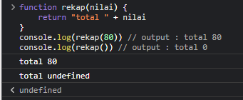

  - ### **Function Helper**
    dengan adanya function helper dapat memaksimalkan function dengan menggunakan function yang sudah dibuat pada function lain, contoh :
    ```javascript
    function timesThree(num) {
        return num * 3;
    }
    function getNumb(numb) {
        return timesThree(numb) + 100;
    }
    console.log(getNumb(4)) // output : 112

    // function getNumb menggunakan function timesThree pada blocksnya
    ``` 
  - ### **Arrow Function**
    cara lain menuliskan function. Ini adalah fitur terbaru yang ada pada ES6 (Javascript Version)
    ```javascript
    // tidak ada parameter
    const function nama = () => {/*blocks*/}

    // satu parameter
    const function rekap = nama => {/*blocks*/}

    // dua atau lebih parameter
    const function rekap = (nama, nilai, absen) => {/*blocks*/}

    // single-line block
    const function rekap = nilai => nilai + nilai

    // multi-line block
    const function rekap = nilai => {
        const times = nilai * nilai
        return times 
    }
    ```
- ### **Error & Debug**
  <div align="justify">contoh error pada function:

  ```javascript
  function ktp() {
    let nik = "31200669980"
    return nik; // output : 31200669980
    }
  console.log(ktp()) // output : 31200669980
  console.log(nik) // output : error
  ```
  output error dikarenakan variabel nik yang tidak terdeteksi karena bukan global scope, eror yang akan tampil sebagai berikut :


  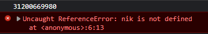

  - ReferenceError = merupakan tipe eror, 
  - nik is not defined = pesan eror
  - at anonymous:6:13 = adalah call stack, yaitu jalur yang telah diambil suatu program  untuk mencapai titik dimana terjadi error
  &nbsp;
  penyelesaiannya dengan membuat variabel nik berjenis global scope atau cukup melakukan panggilan function ktp 
    ```javascript
    let nik = "31200669980"
    function ktp() {
      let nik = "31200669980"
      return nik; // output : 31200669980
    }
    console.log(ktp()) // output : 31200669980
    console.log(nik) // output : 31200669980
    ```
    &nbsp;
  <div align="justify">contoh cara debugging:

  &nbsp;
  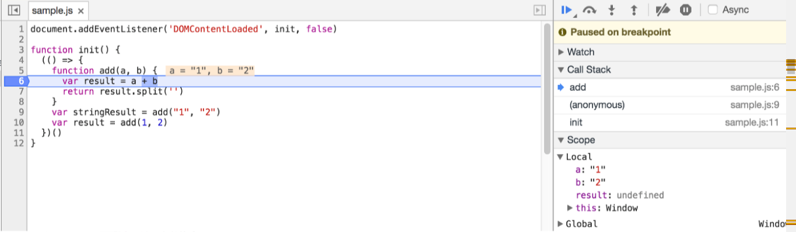

  untuk debug code javascript, bisa menggunakan console.log() variabel yang ingin dicek, dapat menggunakan chrome, buka page dengan code javascript (ctrl+o di windows) dan pilih file yang ingin didebug, klik baris yang ingin di debug dan refresh page (F5).
  Jika line yang di pilih berjalan, dapat melihat apa yang telah terjadi sebelumnya dan dapat mencoba dan evaluasi baris berikutnya untuk cek jika semua output sesuai ekspektasi

&nbsp;

## **JavaScript (DATA TYPE BUILT IN PROTOTYPE & METHOD)**

terdapat tipe data primitif :

1. string
2. number
3. boolean
4. null
5. bigint
6. symbol
7. undefined

tipe data non primitif :

1. Array
2. Object

mengecek tipe data

```javascript
let hewan ="kambing"
typeof hewan // output : string
``` 

properties adalah ciri-ciri tipe data dalam variabel tersebut.
method adalah function untuk keahlian/kemampuan suatu tipe data dalam variabel

- ### **Properti dan Method (STRING)**
  <div align="justify">melihat properti dan metode pada variabel pada javascript untuk membantu dalam proses development, hanya ada satu properti yaitu length adalah menghitung karakter value pada suatu variabel, sebagai berikut :

  ```javascript
  // properti
  let makan = "kambing makan rumput"
  let hewan ="kambing"
  console.log(hewan.length) // output : 7

  // metode adalah sebuah function
  // contoh huruf besar
  console.log(hewan.toUpperCase()) // output : KAMBING

  //contoh huruf kecil
  console.log(hewan.toLowerCase()) //output : kambing

  //mengambil huruf berdasarkan indeks (dimulai dari 0)
  console.log(hewan.charArt(2)) // output : M
  console.log(hewan[1]) // output : A 

  // Mencari apakah suatu value string terdapat pada suatu value string lain (boolean)
  console.log(hewan.includes("n")) // output : true
  // atau (cara panjang)
  for (let i = 0; i<hewan.length; i++) {
    if (hewan[i] == "n") {
      console.log(true)
    }
  }

  //memisahkan string, pemisahannya menjadi array
  console.log (makan.split(' ')); //memisahkan berdasarkan spasi [kambing, makan, rumput]
  ```

- ### **Properti dan Method (NUMBER)**
  <div align="justify">melihat properti dan metode pada variabel pada javascript untuk membantu dalam proses development, sebagai berikut :

  ```javascript
  //mengecek apakah value bukan angka
  isNaN("hallo") // output: true
  isNan(true) // output: false (pada dasarnya boolean adalah angka, true = 1)
  // atau
  typeof 2200 !== 'number' //output : false

  // mengubah number menjadi string
  let angka = 40
  angka.toString() // output : "20"
  // atau
  20 + "" // output : "20"

  //menentukan angka/digit di belakang koma
  let phi = 3.14567788
  phi.toFixed(2) // output : "3.14"

  //mengubah string tetap menjadi number
  Number(phi.toFixed(2)) // output : 3.14
  ```

- ### **Object Prototypes JavaScript**
  <div align="justify"> prototipe adalah mekanisme yang mana object javascript dapat menurunkan suatu fitur ke fitur yang lain,
  contoh :

  ```javascript
  //membalik sebuah string
  // membuat method baru utk tipe data string
  String.prototype.reverse = function(){
    let s = ""
    for let i = String(this).length-1; i >= 0 ; i--) {
      s = s + String(this)[i]
    }

    return s
  }
  // ket : this untuk merepresentasikan string yg di console.log yg akan di eksekusi
  // method dari string
  console.log("hallo".reverse()) //output : ollah
  // function dgn argumen string
  console.log(reverse("hallo"))


  //objek literal
  let kucing = {
    nama: "tom"
    makanan: "ikan"
  }
  //objek dengan constructor(function)
  function kucing(nama, makanan){
    this.nama = nama
    this.makanan = makanan
  }
  const tom = new kucing("tom","ikan")
  tom.umur = 20
  console.log(tom.nama) // output : tom
  console.log(tom.umur) //output : 20
  ```


- ### **Built-In Object JavaScript**

  - **Math**
    <div align="justify">built-in object yang memiliki properti dan method untuk mathematical constannts dan function. dan bukan merupakan function object, contoh :

    ```javascript
    Math.PI //output : 3.141592653589793
    Math.PI.toFixed(2) // output : 3.14 

    // bilangan negatif ke positif (nilai absolut)
    Math.abs(-70) //output : 70

    //maximum dan minimum
    Math.max(2,7,9,6) //output : 9
    Math.min(2,7,9,6) //output : 2

    //akar kuadrat
    Math.sqrt(64) //output : 8

    //pangkat
    Math.pow(3, 2) // output : 9 
    //atau
    3**2

    //membulatkan float ke int
    Math.round(123.24) //output : 123
    Math.floor(4.9) //output : 4 
    Math.ceil(4.1) //output : 5

    // ambil angka random yang dibulatkan
    Math.round(Math.random()*10) //output : 4 (random) 
    ```

&nbsp;

## **JavaScript DOM (Document Object Model)**

<div align="justify">DOM (Document Object Model) bukan bagian dari JavaScript, melainkan browser (Web API) yang digunakan untuk membangun website, DOM bisa diartikan Dokumen HTML yang dimodelkan sebuah objek bertujuan :

1. memanipulasi tampilan (elemen & style) web
2. membuat HTML menjadi dinamis
3. DOM JavaScript dapat mengakses dan memodifikasi seluruh HTML, dll
4. jembatan supaya bahasa pemrograman dapat berinteraksi dengan dokumen HTML, Dengan DOM maka javascript dapat memanipulasi HTML

**HTML DOM**
adalah standar objek model dan programming interface pada HTML, HTML DOM adalah standar untuk mendapatkan, mengubah, menambahkan, menghapus HTML Element, termasuk :

1. HTML element sebagai object
2. properti-properti pada seluruh elemen HTML
3. Metode-metode untuk akese seluruh elemen HTML 
4. event yang ada pada seluruh elemen HTML

```html
</html>
  <head>
    <title>My Web</title>
  </head>
  <body>
    <a href ="www.google.com">google</a>
    <h1>My Heading</h1>
  </body>
</html>
```

file HTML di load pada dokumen browser maka akan merepresentasikan tree structure (struktur DOM), berikut :

&nbsp;

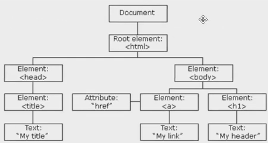

**cara akses DOM**
menggunakan elemen dan node :

1. element (menggunakan HTML elemen) ex : span, div, ul, ol, dll
2. node, memperhatikan bagian kecil baik content maupun atribut, ex : text, comment, span, 

- ### **Traversing**
  Mencari atau mengakses DOM melalui Element HTML 

  - **getElementById** 
    mengembalikan elemen dengan nilai spesifiknya. metode nya mengembalikan null jika elemen tidak ada. 
  - **getElementsByClassName**
    mengembalikan data dalam bentuk collection of elemen (kumpulan dari elemen) berdasarkan nama class nya. kalau yang didapat dalam bentuk HTMLCollection cara aksesnya mirip seperti array. HTMLCollection bukan array.
  - **getElementsByTagName**
    mengembalikan data dalam bentuk collection of elemen (kumpulan dari elemen) berdasarkan nama tag nya. kalau yang didapat dalam bentuk HTMLCollection cara aksesnya mirip seperti array. HTMLCollection bukan array.
  - **querySelectorAll**  
    mengembalikan data yang sesuai dengan CSS selector yang merupakan turunan dari elemen saat ini diambil. dalam bentuk NodeList cara aksesnya mirip seperti array. NodeList bukan array.
  - **querySelector**
    mengembalikan elemen pertama yang sesuai dengan CSS selector yang merupakan turunan dari elemen saat ini diambil.
  - **children**
    mengembalikan semua child elemen pada elemen yang saat ini diambil

  file html

  ```html
  </html>
    <head>
      <title>My Web</title>
    </head>
    <body>
      <h1 id="title">Haloo</h1>

      <ol class = "list">
        <li class = "item">satu</li>
        <li class = "item">dua</li>
        <li class = "item">tiga</li>
      </ol>

    </body>
  </html>
  ```

  file javascript

  ```javascript
  //mengakses h1 dengan id title
  // dan menyimpan ke dalam sebuah variabel 
  let title = document.getElementById("title")
  console.log(title) // output : <h1 id="title">Haloo</h1> (tampil elemennya)

  //mengakses list berdasarkan class
  // dan disimpan kedalam sebuah variabel
  let list = document.getElementsByClassName("list")
  console.log(list) //output : HTML Collection (kumpulan data) karena elements (jamak) 
  console.log(list[0]) //output : <ol class = "list"> </ol>

  //mengakses item berdasarkan class
  // dan disimpan kedalam sebuah variabel
  let items = document.getElementsByClassName("item")
  console.log(items) // output : HTML Collection(3)
  console.log(items[1]) // output : <li class = "item">"dua"</li>

  //mengakses ordered list berdasarkan Tag
  // dan disimpan kedalam sebuah variabel
  let orders = document.getElementsByTagName("li")
  console.log(orders) // output : HTML Collection(3) [li.item, li.item, li.item]
  console.log(orders[1]) // output : <li class = "item">"dua"</li>


  //mendapatkan children li dari parent ol
  let list = document.getElementsByClassName("list")
  console.log(list[0]) //dideklarasikan index karena bentuknya collection/array
  // pemanggilan element childrennya
  console.log(list[0].children) //output : HTMLCollection(3) [li.item, li.item, li.item]

  // mendapatkan list dengan querySelector
  // penulisan (.list) seperti css
  let listQuery = document.querySelector(".list")
  console.log(listQuery) //output : <ol class="list"> </ol>
  let itemQuery = document.querySelector(".item")
  console.log(itemQuery) //output : li.item "satu" (diambil dari yg pertama kali muncul)

  // mendapatkan list dengan querySelectorAll
  // penulisan (.item) seperti css
  let itemQueryAll = document.querySelectorAll(".item")
  console.log(itemQueryAll) // output : NodeList(3) [li.item, li.item, li.item]
  console.log(itemQueryAll[1]) // output : <li class ="item> "dua" </li>

  //mengakses elemen parent list (li)
  console.log(itemQuery.parentElement) // output : <ol class = "list"> </ol> 

  //mencari parent terdekat (closest)
  console.log(itemQuery.closest('.list')) //output : <ol class = "list"> </ol>

  //akses sibling sebelumnya (kakak)
  console.log(itemQuery.previousElementSibling) // null (karena class item pertama tidak ada sibling atasnya)

  //akses sibling sesudahnya (adik)
  console.log(itemQuery.nextElementSibling) // output : <li class = "item"> "dua"</li> 

  //melakukan looping 
  for (let i = 0; i < itemQueryAll.length; i++) {
    console.log(itemQueryAll[i]) //output :<li class = "item"> "satu"</li>, <li class = "item"> "dua"</li>, <li class = "item"> "tiga"</li> 
  }
  ``` 

- ### **Manipulating**
  kemampuan DOM yang dapat memanipulasi dan mengubah struktur HTML. tujuan pengembangan web dengan manipulasi DOM javascript yaitu menggunakan konsep SPA (Single Page Application) satu halaman HTML. Halaman website tidak melakukan reload.

  - **innerHTML** 
    mengambil dan memanipulasi konten HTML pada suatu elemen
  - **innerText**
    memanipulasi struktur HTML hanya berupa string/teks saja
  - **createElement**
    untuk membuat elemen HTML baru, misal div, p, span, h1, dll
  - **append**
    menyisipkan sebuah node setelah node child terakhir pada node parent
  - **appendChild**
    menyisipkan node ke list node-node child pada node parent yang spesifik
  - **remove**
    menghapus elemen atau node HTML atau dokumen

  ```html
  </html>
    <head>
      <title>My Web</title>
    </head>
    <body>
      <div id="app"></div>
      <div id="end"></div>
    </body>
  </html>
  ```

  ```javascript
  //menambahkan tulisan hallo
  let app = document.getElementById('app')
  //bisa pakai innerHTML / innerText
  app.innerText = "Hallo"
  //innerHTML bisa mengimplementasikan tag/format html
  app.innerHTML = "<h1>Hallo</h1>"
  ```

  innerText (kiri) innerHTML (kanan)

  &nbsp;

  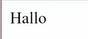
  

  ```javascript
  //membuat sebuah elemen
  let p = document.createElement("p")
  //isi p dengan tekx
  p.innerText = "ini adalah paragraf"
  //menyisipkan p kedalam div 
  // pada bagian/id app ingin menyisipkan paragraf
  app.append(p)

  let p2 = document.createElement("p")
  //isi p dengan teks
  p2.innerText = "paragraf ke-2"
  app.appendChild(p2)
  app.append("menggunakan append") // masih bisa jalan
  app.appendChild("appendChild") // tidak bisa jalan (karena cuma bisa menerima sebuah node)
  ```

  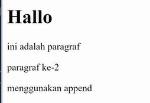

  ```javascript
  //menghapus elemen atau node pada HTML
  let end = document.getElementById('end')
  end.remove()
  ```

  - **attributes**
    untuk mengetahui ada atribut apa saja dalam dokumen atau HTML node tersebut
  - **getAttribute**
    untuk melihat isi dari atribut nya
  - **setAttribute**
    untuk menambah atribut, ada dua argumen yang harus diisi yaitu : nama atribut dan value nya
  - **style.**
    styling layaknya css dari DOM. 
    ex : p.style.color, p.style.border, p.style.padding, dll
  - **getComputedStyle**
    ambil atau tampilkan style lewat DOM dengan getComputedStyle (untuk mengetahui value stylenya)

  File HTML

  ```html
  </html>
    <head>
      <title>My Web</title>
    </head>
    <body>
      <div id="tess"></div>
      <div id="app"></div>
      <div id="end">
        <a href="google.com" class= "link">Google</a>
      </div>
    </body>
  </html>
  ```

  File JavaScript

  ```javascript
  //melihat attribut apa saja
  let link = document.getElementsByClassName("link")[0]
  console.log(link.attributes) //output : href dan class
  ```

  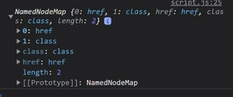

  ```javascript
  //melihat isi dari suatu atribut
  console.log(link.getAttributes("href")) //output : google.com

  //menambahkan atribut
  link.setAttribute("id", "google")   
  ```

  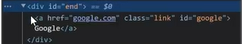

  ```javascript
  //Styling via DOM
  link.style.color = "black"
  link.style.border = "1 px solid black"
  link.style.padding = "5px 20px"
  link.style.backgroundColor = "aqua"
  ```

  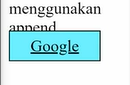

  ```javascript
  //ambil atau tampilkan style lewat DOM dengan getComputedStyle (untuk mengetahui value stylenya)
  let tess = document.getElementById("tess")
  let tessStyle = getComputedStyle(tess)
  console.log(tessStyle.height) //output : 20px
  //atau tanpa variabel tessStyle langsung console.log
  console.log(getComputedStyle(tess).height) //output : 20px
  ```

- ### **Interaksi User (EVENTS)**
  <div align="justify">
  dikarenakan sebuah halaman web yang harus dapat menangkap interaksi user untuk memaksimalkan user experience, dibutuhkan events. 3 cara memberikan event :

  1. **HTML attribute**.
    menjalankan event dengan HTML attribute, berikut contoh file HTML dan outputnya:

    ```html
    <html>
      <head>
        <title>Document</title>
      </head>
      <body>
        <!-- dapat diklik dan akan menjalankan sesuatu -->
        <h1 onclick="alert('selamat datang')">Hallo</h1>
      </body>
    </html>
    ``` 

    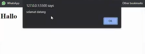


  2. **event property**
    menjalankan event dengan event properti, berikut contoh :

    ```html
    <html>
      <head>
        <title>Document</title>
      </head>
      <body>
        <!-- dapat diklik dan akan menjalankan sesuatu -->
        <h1 onclick="alert('selamat datang')">Hallo</h1>
        <p id="paragraf">click me</p>
      </body>
    </html>
    ``` 

    ```javascript
    let paragraf = document.getElementById("paragraf")
    paragraf.onclick = function () {
      alert("ini dari paragraf")
    }
    ```

    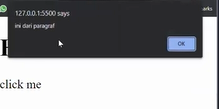


  3. **addEventListener()**
    menjalankan event dengan menambahkan event listener, keuntungan dengan menggunakan addEventListener : 

    - dapat dihilangkan, 
    - Bisa ada beberapa event listener yang sama untuk 1 elemen, 
    - memiliki argumen tambahan {option}. contoh :

    ```html
    <html>
      <head>
        <title>Document</title>
      </head>
      <body>
        <!-- dapat diklik dan akan menjalankan sesuatu -->
        <h1 onclick="alert('selamat datang')">Hallo</h1>
        <p id="paragraf">click me</p>
        <button id="btn">klik saya</button>
      </body>
    </html>
    ``` 

    ```javascript
    let button = document.getElementById("btn")
    //argumen 1 adalah eventnya apa, argumen 2 adalah function (disini pakai arrow function)
    button.addEventListener("click", () => {
      confirm('ini dari button')
    })
    ``` 

    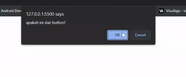

  - **properti event.target**
    untuk mengetahui target atau properti yang diambil untuk event tersebut. 

    ```javascript
    let button = document.getElementById("btn")
    button.addEventListener("click", (event) => {
      console.log(event.target) //<button id="btn">klik saya</button>
    })
    ```

  Macam-macam events, selain click :

  - **submit**
    mendapatkan isi dari input saat submit form

    ```html
    <form onsubmit="alert('submit!');return false">
      First: Enter in the input field <input type="text" value="text"><br>
      Second: Click "submit": <input type="submit" value="Submit">
    </form>
    ```

    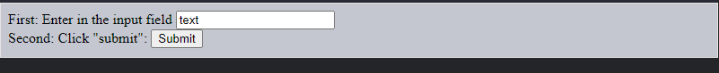

  - **blur**
    event di mana sebuah element kehilangan fokus dari user (misal user klk mouse di luar element tersebut atau user klik tab untuk berpindah element)

    ```javascript
    // cari dulu element tersebut berdasarkan id-nya
    const input = document.getElementById('username')
    // tambahkan event listener
    input.addEventListener('blur', () => {
      if(input.value.length < 6) alert('Panjang username minimal 6')
    })
    ```

    ket : akan tampil alert 'Panjang username minimal 6' jika panjang value dari variabel input kurang dari 6
