# **Writing Week 3**
## **JS Array & Multidimensional Array**
- ### **Apa itu Array ?**
  <div align="justify">Sebuah tipe data jenis list order yang dapat menampung banyak tipe data apapun didalamnya, seperti string, number, boolean, dan lainnya.

  ```javascript
  //struktur array bisa menggunakan let, var maupun const
  let namaArray = [data1, data2,..]

  //contoh 1
  //menyimpan tipe data sama
  let myList = [
    "Belajar Coding",
    "Belajar Akuntansi",
    "Belajar Perpajakan",
  ]
  console.log(myList)
  console.log(myList[1]) //output : 'Belajar Akuntansi'
  

  //contoh 2
  //menyimpan tipe data yang tidak sama
  let listArr = [
    "true", 0, true
  ]
  console.log(listArr)
  ```

  Array pada javascript dihitung dari index data ke-0. Data pertama adalah index ke-0. contoh 1 (kiri) contoh 2 (kanan)

  &nbsp;

  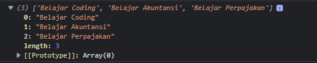
  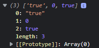

  &nbsp;

- ### **Update Array**
  <div align="justify">Array layaknya tipe data lain yang isinya dapat diubah atau diganti dengan update data, contoh :

  ```javascript
  let myList = [
    "Belajar Coding",
    "Belajar Akuntansi",
    "Belajar Perpajakan",
  ]

  //panggil nama array, square bracket dengan nomor index berdasarkan data array yang ingin diubah
  myList[0] = "Belajar Data Analytic"
  console.log(myList) 
  // output :  ['Belajar Data Analytic', 'Belajar Akuntansi', 'Belajar Perpajakan']
  ```

- ### **Array Properties & Methods**
  <div align="justify">pada dasarnya Properties dan metode adalah fitur yang sudah disediakan oleh Javascript untuk memudahkan developer. tipe data memiliki properties dan methods tak terkecuali untuk tipe data array

  - **length**
    akan mengembalikan nilai dari jumlah panjang data suatu array

    ```javascript
    let listArr = [
        "true", 0, true
    ]
    console.log(listArr.length) //output : 3
    ```

  - **.push()**
    menambahkan item array pada urutan yang paling akhir.

    ```javascript
    let myList = [
        "Belajar Coding",
        "Belajar Akuntansi",
        "Belajar Perpajakan"
    ]
    myList.push('Belajar Data Analytic')
    console.log(myList)
    // output : [ "Belajar Coding", "Belajar Akuntansi", "Belajar Perpajakan","Belajar Data Analytic"] 
    ```

  - **.pop()**
    menghapus item array index terakhir.

    ```javascript
    let myList = [
        "Belajar Coding",
        "Belajar Akuntansi",
        "Belajar Perpajakan"
    ]
    myList.pop()
    console.log(myList)
    //output : ["Belajar Coding", "Belajar Akuntansi"]
    ```

  - **.shift()**
    menghapus item Array pada index pertama

    ```javascript
    let myList = [
        "Belajar Coding",
        "Belajar Akuntansi",
        "Belajar Perpajakan"
    ]
    myList.shift()
    console.log(myList)
    //output : ["Belajar Akuntansi", "Belajar Perpajakan"]
    ```

  - **.unshift()**
    menambahkan item Array pada index pertama

    ```javascript
    let myList = [
        "Belajar Coding",
        "Belajar Akuntansi",
        "Belajar Perpajakan"
    ]
    myList.unshift('Belajar Data Analytic')
    console.log(myList)
    //output : ["Belajar Data Analytic", "Belajar Coding", "Belajar Akuntansi", "Belajar Perpajakan"]
    ```

  - **.sort()**
    mengurutkan secara Ascending atau Descending Alphanumeric.

    ```javascript
    const angka = [67, 45, 20, 30]
    angka.sort()
    console.log(angka)
    //output : [20, 30, 45, 67]
    ```

  - **.splice()**
    memanipulasi (replace, hapus) item Array di tengah

    ```javascript
    let myList = [
        "Coding",
        "Akuntansi",
        "Perpajakan,"
        "Database"
    ]
    // ada dua argumen (2) adalah index yang ingin dihapus, (1) adalah jumlah data yang ingin dihapus
    myList.splice(2, 1)
    console.log(myList)
    //output : ["Coding", "Akuntansi", "Database"]

    // ada satu argumen (2) adalah index yang ingin dihapus, maka sisa data sesudahnya terhapus
    myList.splice(2)
    console.log(myList)
    //output : ["Coding", "Akuntansi"]

    // ada tiga argumen (2) adalah index yang ingin dihapus, (1) adalah jumlah data yang ingin direplace, "perpajakan" akan di replace "mandarin"
    myList.splice(2, 1, "Mandarin")
    console.log(myList)
    //output : ["Coding", "Akuntansi", "Mandarin",  "Database"]
    ```

    
  - **.slice()**
    metode mengembalikan shallow copy, menyalin data berdasarkan argumen yang diinput tanpa merubah data yang ada. dapat mengembalikan dan menyimpan salinannya dengan variabel baru

    ```javascript
    let angka = [67, 45, 20, 30]
    let sliceCoba = angka.slice(2)
    console.log(sliceCoba)
    //output : [20]
    ```

- ### **Array Looping**
  <div align="justify">Salah saty built in method pada array yakni melakukan looping dengan .map() dan .forEach()

  ```javascript
  // .forEach()
  let angka = [4, 8, 12, 16];
  angka.forEach((num, index) => {
    return angka[index] = num / 2
  })
  console.log(angka)
  //output : [2, 4, 6, 8]

  // .map()
  let angka = [4, 8, 12, 16];
  let bagiDua = angka.map(num => {
    return num / 2;
  })
  console.log(bagiDua)
  //output : [2, 4, 6, 8]
  ```

  - **Perbedaan .map() dan .forEach()**
    map dan forEach memiliki persamaan yaitu melakukan looping dan mengembalikan nilai baru dari operasi yang dilakukan. Namun, .forEach tidak dapat membuat Array baru dari hasil operasi yang ada dalam looping dan digunakan jika memerlukan looping untuk menampilkan saja atau menyimpan ke database. Sedangkan, .map() dapat membuat Array baru dari hasil operasi yang ada dalam looping dan digunakan jika akan melakukan operasi pada array seperti yang dapat mengubah nilai array sebelumnya.

    ```javascript
    // return nilai ke variabel array baru dengan .map()
    let desimal = [0.78, 0.9, 0.54]
    let persen = desimal.map ((angka) => {
        return angka * 100 + "%"
    })
    console.log(persen)
    //output [78%, 90%, 54%]


    // return nilai ke variabel array baru dengan .forEach()
    let desimal = [0.78, 0.9, 0.54]
    let persen = []
    desimal.forEach((angka) => {
        persen.push(angka * 100 + "%")
    })
    console.log(persen)
    //output [78%, 90%, 54%]
    ```

- ### **Array Multidimensional**
  <div align="justify">dianalogikan sebagai array dalam array. dimana dalam suatu array data didalamnya bertipe data array juga. Layaknya tabel, array multidimensional direpresentasikan memiliki baris dan kolom.
  
  ```javascript
  let rekapNilai = [
    ['Abay', 87],
    ['Ghani', 90],
    ['Aladdin', 68],
  ]
  //direpresentasikan memiliki 3 baris dan 2 kolom
  console.log(rekapNilai)
  //mengambil baris index 1 dan kolom index 0
  console.log(rekapNilai[1][0]) //output : "Ghani"
  ```

  cara mengubah data pada array multidimensional

  ```javascript
  let rekapNilai = [
    ['Abay', 87],
    ['Ghani', 90],
    ['Aladdin', 68],
  ]
  rekapNilai[2][0] = "jasmine"
  ```

  menggunakan propery dan method built-in pada array multidimensional, contoh:

  ```javascript
  rekapNilai.push(['rose', 85])
  ```
  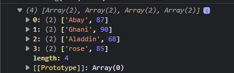

  melakukan looping pada array multidimensional

  ```javascript
  rekapNilai.forEach((list) => {
    list.forEach((kolom) => {
        console.log(kolom)
    })
  })
  ```

  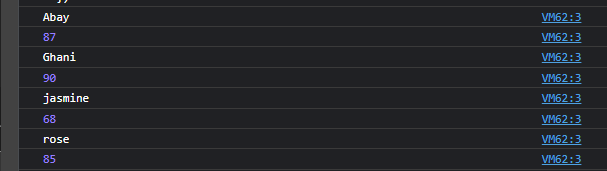

  &nbsp;

## **JS Object**
  <div align="justify">sebuah tipe data pada variabel yang menyimpan properti dan fungsi (method) dan dapat menyimpan berbagai macam tipe data. Properti adalah data lengkap dari sebuah object. Method adalah action dari sebuah object.

  ket : name, color, age, living a life adalah key/properties.

  ```javascript
  // object dengan properti
  let cat = {
    name: 'oyen',
    color: 'brown-yellow',
    age : 2,
    //pakai single quote pada key jika ada spasi
    'living a life' : true
  }
  console.log(cat);
  ```

  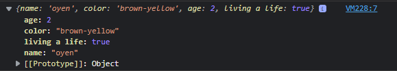

  mengakses properti object

  ```javascript
  console.log(cat.color) //output : 'brown-yellow'
  //atau
  console.log(cat['color']) //output : 'brown-yellow'
  ```

  - **Update Object**
    mengupdate value dari key yang sudah tersedia, dan menambahkan key dan value baru, menggunakan variabel selain const
    
    ```javascript
    //update key yang sudah ada dengan nilai baru
    cat.name = 'pussy'
    //menambahkan key dan nilai baru
    cat.food = 'whiskas'
    console.log(cat)
    ```

    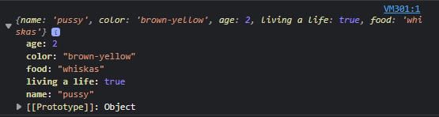

  - **Delete Object Property**
    menghapus properti dari object menggunakan delete operator.

    ```javascript
    delete cat.age
    console.log(cat)
    //output : { name: 'oyen', color: 'brown-yellow', 'living a life' : true}
    ```

  - **Object Method**
    value yang ada pada property berupa function, function tersebut disebut method

    ```javascript
    const congrats = {
        achieve: function () {
            return 'Congratulation, you deserved it'
        },
        tryAgain: function () {
            return "we're sorry, try again later"
        },
    }
    console.log(congrats.achieve()) // 'Congratulation, you deserved it'
    console.log(congrats.tryAgain()) // 'we're sorry, try again later'
    ```

  - **Nested Object**
    Object yang berasal dari turunan object lainnya
    
    ```javascript
    const school = {
        name: 'Ankara University',
        address: 'Ankara, Turki',
        worldRank: 34,
        lecturer: {
            people: {
                name: 'mehmet azhir',
                age: 45,
                city: 'istanbul'
            },
        },
    }
    console.log(school.name, 'got', school.worldRank, 'of World Rank')
    console.log(school.lecturer.people.name, 'is the best lecturer ever there')
    //output :
    //Ankara University got 34 of World Rank
    //mehmet azhir is the best lecturer ever there
    ```

  - **Passed by Reference**
    mengubah data yang ada pada object melalui sebuah function dan memasukkan object sebagai parameter function.

    ```javascript
    let angka = {
        normalA: 10,
        normalB: 11,
    }
    function decrement (object) {
        object.normalA--
        object.normalB--
    }
    decrement(angka)
    console.log(angka.normalA) // output : 9
    console.log(angka.normalB) // output : 10
    ```

  - **Looping Object**
    Looping for in sebagai alternatif menampilkan seluruh object properti. tidak perlu mengakses secara manual memanggil setiap propertinya.

    ```javascript
    const school = {
        name: 'Ankara University',
        address: 'Ankara, Turki',
        worldRank: 34,
        lecturer: {
            people: {
                name: 'mehmet azhir',
                age: 45,
                city: 'istanbul'
            },
        },
    }
    for (let lecturer in school.lecturer.people) {
        console.log(school.lecturer.people[lecturer])
    }
    //output :
    // mehmet azhir
    // 45
    // istanbul
    ```

  - **Array of Object**
    Object sama seperti Array yang bisa menyimpan banyak data. Banyak data termasuk tipe data array

    ```javascript
    let patients = [
        {
            name: 'Larv',
            diagnose: 'asma',
        },
        {
            name: 'asmar',
            diagnose: 'kolesterol',
        },
        {
            name: 'ranpo',
            diagnose: 'hipertensi',
        }
    ]
    // menggunakan forEach untuk menampilkan object of array
    patients.forEach(function (listPasien) {
        console.log(listPasien)
    })

    //atau pakai map dan arrow function
    let dataPasien = patients.map((listPasien) => {
        return listPasien
    })
    //bisa panggil variabelnya
    console.log(dataPasien)
    ```

    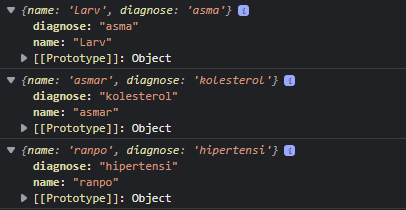

  &nbsp;

## **JS Recursive**
  <div align="justify">function yang memanggil dirinya sendiri sampai kondisi tertentu. kebanyakan digunakan untuk case matematika, fisika, kimia, dan yang berhubungan dengan calculation
  
  - **Struktur Recursive**

    1. Fungsi rekursif selalu memiliki kondisi yang menyatakan kapan fungsi tersebut berhenti
    2. Fungsi rekursif selalu memanggil dirinya sendiri sambil mengurangi atau memecahkan data masukan setiap panggilannya

    ```javascript
    function nama_function () {
        if (kondisi) {
            // akan berhenti memanggil jika kondisi sudah terpenuhi
        } else {
            nama_function()
        }
    }
    ```
  - **Contoh Kasus**
    
    ```javascript
    //menghitung mundur angka genap
    function mundurGenap(angka) {
        console.log(angka)

        let seterusnya = angka - 2

        //jika kondisi bernilai false (terpenuhi) maka recursive berhenti
        if (seterusnya > 0) {
            mundurGenap(seterusnya)
        }
    }
    mundurGenap(12)
    ```

    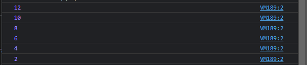

    &nbsp;

- ## **JS Modules**
  <div align="justify">reusable code yang dapat di export dari suatu file JS dan di import ke file lain. untuk mempermudah pengelolaan dan  meminimalisir bertumpuknya kodingan, contoh pengaplikasian modules :

  ```html
  <!DOCTYPE html>
  <html lang="en">
    <head>
        <meta charset="UTF-8">
        <meta http-equiv="X-UA-Compatible" content="IE=edge">
        <meta name="viewport" content="width=device-width, initial-scale=1.0">
        <title>Document</title>
    </head>
    <body>
    <!-- menambahkan script untuk menghubungkan dengan file js -->
    <script src="./index.js"></script>
    </body>
  </html>
  ```

  dmisal, dalam satu folder tersebut terdapat dua file javascript yaitu index.js dan data.js

  ```javascript
  //pada file data.js
  //keterangan : export dimana data disiapkan untuk 'dikeluarkan' dan dapat diakses file lain
  export let school = [
    {
        name: "SMKN 1 Cibitung",
        total_siswa: 200,
    }, 
    {
        name: "SMKN 2 Babelan",
        total_siswa: 300,
    }, 
    {
        name: "SMAN 1 Tambun",
        total_siswa: 400,
    }]


  //pada file index.js
  //keterangan : import dimana dapat mengakses file lain dimana file tersebut memiliki keterangan exportnya
  import {school} from "./data.js"
  console.log(school)
  ```

  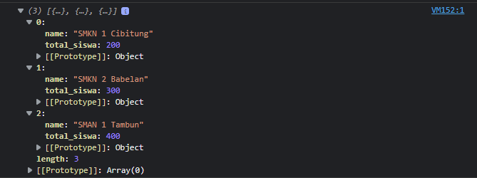

  &nbsp;

- ## **JS Asynchronous**
  <div align="justify">Pada konsep web development dikenal istilah Asynchronous. kegunaan Asynchronous mengizinkan komputer memproses task yang lain sambil menunggu proses yang masih berlangsung. cara membuat asynchronous secara simulasi pada javascript :

  - **Callback**
    <div align="justify">function yang di letakan di dalam argumen/parameter pada function, dan function tersebut akan dieksekusi setelah function pertama menyelesaikan tugasnya, contoh :

    ```javascript
    const desimal = (angka, siap) => {
        console.log(angka / 100)
        siap()
    }
    const akuSiap = () => {
        console.log('siap')
    }
    desimal(30, akuSiap)
    //output :  
    // 0.3
    // siap
    ```

  - **Promises**
    <div align="justify">biasa digunakan untuk melakukan http request/fetch data dari API, 3 kemungkinan state dalam pengambilan data :

    1. Pending(sedang dalam proses)
    2. Fulfilled (berhasil)
    3. Rejected (gagal)

    ```javascript
    let targetDiet = (target) => {
        return new Promise((resolve, reject) => {
            if (target >= 10) {
                resolve("Berat Badan turun")
            }
            reject('gagal diet')
        })
    }
    //eksekusi proses
    targetDiet(20)
        .then((result) => {
            console.log(result + ` dengan sehat`);
        })
        .catch((err) => {
            console.log(err)
        })
    ```

    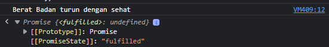

  - **Async/Await**
    <div align="justify">untuk menangani hasil dari sebuah Promise. dan await berfungsi untuk menunda sebuah kode dijalankan sampai proses asynchronous berhasil. strukurnya :

    ```javascript
    const greeting = async () => {
        let result = await 'bonjour, mr & mrs'
        return result
    }
    ```

  - **HTTP Request fetch()**
    <div align="justify">Fetch adalah native web API untuk melakukan HTTP calls dari external network. Contoh function untuk mengambil data dari API menggunakan fetch():

    ```javascript
    //dengan Promise
    fetch("https://jsonplaceholder.typicode.com/users")
        .then(function (response) {
            return response.json();
        })
        .then(function (post) {
            console.log(post);
        });

    //dengan async/await
    const tesFetchAsync = async () => {
        let response = await fetch("https://jsonplaceholder.typicode.com/users");
        response = await response.json();
        console.log(response);
    };
    tesFetchAsync();
    ```

    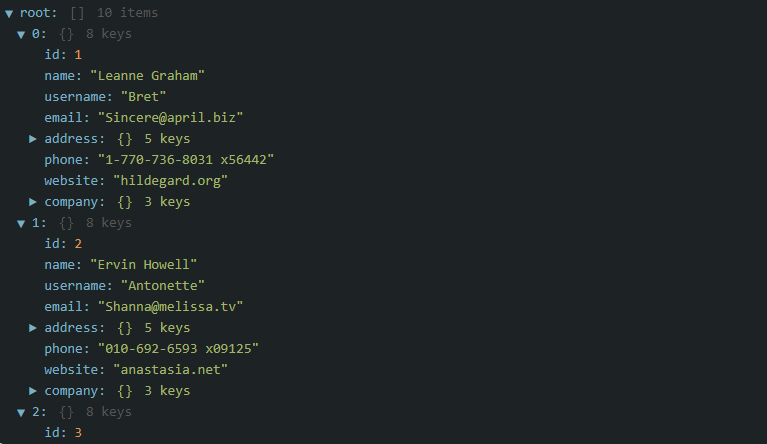

    &nbsp;

- ## **Web Storage**
  <div align="justify">menyimpan data pengguna seperti pencarian, artikel berita, dan lain-lain ke lokal (browser) menggunakan web storage
  
  - **Cookies**
    data kecil yang dikirim dari situs web dan disimpan di komputer oleh web browser saat menjelajah. Disebut data kecil karena maksimum data yang dapat disimpan dalam cookies adalah 4096 bytes (4 KB).

  - **Local Storage**
    <div align="justify">memiliki karakteristik sebagai berikut:
    
    1. Menyimpan data tanpa tanggal kadaluarsa
    2. Data tidak akan dihapus ketika web browser ditutup dan akan tersedia seterusnya selama kita tidak menghapus data local storage pada web browser.
    3. Dapat menyimpan data hingga 5MB.
    4. Hanya dapat menyimpan data string.

    contoh :

    ```html
    <!-- menyiapkan file html -->
    <!DOCTYPE html>
    <html lang="en">
    <head>
        <meta charset="UTF-8">
        <meta name="viewport" content="width=device-width, initial-scale=1.0">
        <title>Document</title>
    </head>
    <body>
        <form>
            <input type="text" id="searchkey" name="searchkey" placeholder="Search Something"><br>
            <input type="submit" value="Search" onclick="onSearch()">
        </form>  
        <div id="search-history"></div>
        <button onclick="clearSearchHistory()">Hapus Riwayat</button>
        <script></script>
    </body>
    </html>
    ```

    ```javascript
    //file javascript local storage menyimpan data
    var searchList = [];
    function onSearch() {
        var searchValue = document.getElementById('searchkey').value;
        searchList.push(searchValue) // memasukan kata pencarian ke dalam array
        var searchListString = JSON.stringify(searchList); // mengubah array menjadi string
        localStorage.setItem('searchKey', searchListString); // menyimpan pencarian dengan key 'searchKey'
    }
    ```

    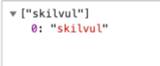

    ```javascript
    //file javascript local storage mengambil data
    var searchList = JSON.parse(localStorage.getItem("searchKey")) || []; // jika searchKey bernilai undefined, maka set searchList sebagai empty array
    function getSearchHistory() {
        var list = '';
        for (var i = 0; i < searchList.length; i++) {
            list += `<div>${searchList[i]}</div>`;
        }
        document.getElementById('search-history').innerHTML = list;
    }
    // memanggil fungsi getSearchHistory
    if (searchList.length > 0) {  // Jika panjang array searchList > 0
        getSearchHistory(); // panggil fungsi getSearchHistory
    ```

    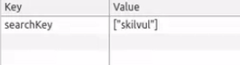

    ```javascript
    //file javascript local storage menghapus data
    function clearSearchHistory() {
        localStorage.removeItem("searchKey"); // menghapus data pada localStorage dengan key "searchKey"
        document.getElementById('search-history').innerHTML = ""; // mengosongkan riwayat pencarian
    }
    ```

  - **Session Storage**
    <div align="justify">memiliki karakteristik sebagai berikut :

    1. Data yang disimpan pada session storage akan terus tersimpan selama browser terbuka dan tidak hilang jika laman di-reload.
    2. Membuka banyak tab/window dengan URL yang sama, akan menciptakan session storage yang berbeda di masing-masing tab/window.
    3. Menutup tab/window akan mengakhiri session dan menghapus data yang tersimpan di session storage pada tab/window tersebut.
    4. Data yang tersimpan dalam session storage harus berbentuk string.
    5. Hanya dapat menyimpan data sebanyak 5MB.

    contoh :

    ```html
    <!-- menyiapkan file html -->
    <!DOCTYPE html>
    <html>
    <head>
        <meta charset="UTF-8">
        <meta name="viewport" content="width=device-width, initial-scale=1.0">
        <title>Document</title>
    </head>

    <body>
    <div class="list-wrapper">
        <div class="list">
            <div style="flex: 1">Susu -  Rp. 18.000,-</div>
            <button onclick="addToCart('susu', 1)">Add to cart</button>
        </div>
        <div class="list">
            <div style="flex: 1">Telor -  Rp. 28.000,-</div>
            <button onclick="addToCart('telor', 1)">Add to cart</button>
        </div>
        <div class="list">
            <div style="flex: 1">Madu -  Rp. 48.000,-</div>
            <button onclick="addToCart('madu', 1)">Add to cart</button>
        </div>
        <div class="list">
            <div style="flex: 1">Jahe -  Rp. 8.000,-</div>
            <button onclick="addToCart('jahe', 1)">Add to cart</button>
        </div>
    </div>
    </body>
    <script src="index.js"></script>
    </html>
    ```

    
    ```javascript
    //file javascript session storage menyimpan data
    let cartList = [];
    function addToCart(name, qty){
        cartList.push({
            name,
            qty
        });
        sessionStorage.setItem("carts", JSON.stringify(cartList)); // array object diubah menjadi string
    }
    ```

    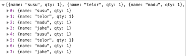

    ```javascript
    //file javascript session storage mengambil data
    var cartList = JSON.parse(sessionStorage.getItem('carts')); // mengambil data dari session storage, di parsing kembali dari string menjadi array object

    // merender name dan qty dari cart
    var list = '';
    for (var i = 0; i < cartList.length; i++) {
        list += `<div class="row">
            <div id="name">${cartList[i].name}</div>
            <div id="qty">${cartList[i].qty}</div>
        </div>`
    }
    document.getElementById('list-cart').innerHTML = list;
    ```

    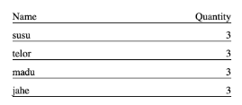

    ```javascript
    //file javascript session storage menghapus data
    function removeFromCart(name) {
        const indexItem = cartList.findIndex(data => data.name === name)
        if(indexItem > -1) {
            if(cartList[indexItem].qty > 1) { // Jika qty barang lebih dari 1
                cartList[indexItem].qty -=1 // maka qty barang dikurangi 1
            } else { // tapi jika qty barang = 1
            cartList.splice(indexItem, 1) // maka hapus barang dari cart
        }
    }
    sessionStorage.setItem("carts", JSON.stringify(cartList)); // memperbaharui data keranjang
    };
    //output : qty berkurang 1 atau -1 jika klik remove
    ```


