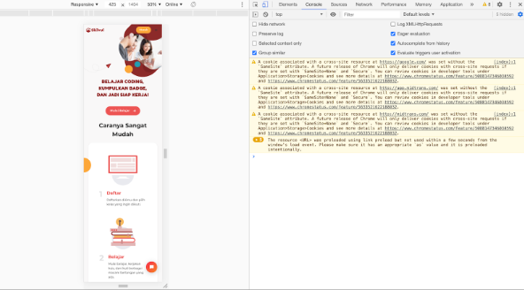

# **Writing Week 4**
## **JS Asynchronous (Fetch & Async/Await)**
<div align="justify">dalam sebuah web development dibutuhkan server untuk pengelolaan data pada web tersebut. Karena, tanpa server dan hanya mengandalkan perubahan konten di HTML dan CSS dapat membuat pengerjaan dan maintanance web sangat tidak efektif. Dapat menggunakan Asynchronous untuk mengambil data dari server API. 

  - **Async Await**
    <div align="justify">untuk menangani hasil dari sebuah Promise. dan await berfungsi untuk menunda sebuah kode dijalankan sampai proses asynchronous berhasil. strukurnya :

    ```javascript
    // Bentuk pertama
    const greeting = async () => {
        let result = await promise()
        return result
    }
    // bentuk kedua
    async function greeting() {
        let result = await promise()
        return result
    }
    // bentuk ketiga (handle error)
    async function greeting() {
        try {
            let result = await promise()
            return result
        } catch (error) {
            return error
        }
    }
    ```

  - **Fetch()**
    <div align="justify">Fetch adalah native web API untuk melakukan HTTP calls dari external network. Contoh function untuk mengambil data dari API menggunakan fetch():

    ```javascript
    //dengan Promise
    fetch("https://jsonplaceholder.typicode.com/users")
        .then(function (response) {
            return response.json();
        })
        .then(function (post) {
            console.log(post);
        });

    //dengan async/await
    const tesFetchAsync = async () => {
        let response = await fetch("https://jsonplaceholder.typicode.com/users");
        let result = await response.json();
        console.log(result);
    };
    tesFetchAsync();
    ```
    output pengambilan data menggunakan fetch API sebagai berikut :

    &nbsp; 
    

    &nbsp;

## **Git & Github Lanjutan (Kolaborasi)**
<div align="justify">Dengan menggunakan GIT dan Github, mempermudah kerjasama tim. Tujuan besarnya adalah bisa berkolaborasi mengerjakan proyek yang sama tanpa harus repot copy paste folder aplikasi yang terupdate. Juga tidak perlu menunggu rekan dalam satu tim menyelesaikan suatu program dahulu untuk berkolaborasi.

1. ### **Buat Organization pada Github** 

  - membuat organization
  - invite anggota tim dan jadikan owner

2. ### **Buat Repositori pada Organization** 

  - membuat repositori untuk project yang akan dibuat
  - dan di setting public
  - buat branch selain master/main, misal branch development. 

  

3. ### **Clone Repositori** 

  - salin link repositori
  - git clone pada terminal

  ```
  $ git clone <link-repo>
  ```

5. ### **Git Branch** 

  - melakukan pengerjaan pada branch yang ada di dalam branch development 

  ```
  $ git branch <nama-branch-baru>
  ```

6. ### **Git Switch / Git Checkout** 

  - untuk berpindah pindah branch misal dari branch main ke branch dev

  ```
  $ git switch <nama-branch-baru-pada-dev>
  $ git checkout <nama-branch-baru-pada-dev>
  ```

7. ### **Pull Request pada Github** 

  - mengajukan pull request, yaitu mengajukan permintaan menggabungkan branch yang dibuat ke branch development atau lainnya


  

  - anggota yang telah pull request melakukan assign ke team leader

  - team leader dapat memberikan label terhadap pull request anggota  

  - Team Leader melakukan merge pull request


   

8. ### **Git Pull** 

  - ada update pada remote repositori github maka agar local mendapatkan update an tersebut dapat melakukan git pull. sebelumnya kembali terlebih dahulu ke branch development

   ```
   $ git branch <branch-dev>
   $ git pull
   ```

9. ### **Git Merge** 

  - ambil dan gabung file atau konten terbaru (menyatukan  pekerjaan) sebuah branch, misal development ke dalam branch yang saat ini digunakan

   ```
   $ git merge <nama-branch>
   ```

10 . ### **Git Push** 

  - dari local ke remote github organization

   ```
   $ push origin <nama-branch-saat-ini>
   ```

   - setelah push lakukan pull request lagi

<div align="justify">Terjadi conflict apabila tidak bisa menggabungkan suatu branch ke branch lain. Ketika lebih dari satu orang mengerjakan di file yang sama terutama di line yang sama (bentrok).


<div align="justify">cara menangani conflict :

1. kembali ke kodingan local lakukan git branch dev -> git pull (pada branch dev) -> git merge dev

2. tampil conflict

    

    ket : dapat memilih perubahan terbaru (current change), incoming change, both changes, compare changes

3. lakukan perubahan dengan benar

4. git add -> git commit -> git push -> merge pull request (team-leader)

5. tidak perlu melakukan pull request lagi langsung di merge

&nbsp;

## **Responsive Web Design**

<div align="justify">bertujuan untuk membuat desain website dapat diakses dalam device apapun. tergantung pada user yang menggunakan, device yang dipakai umumnya laptop/PC, smartphone dan tablet. 

  - **Chrome Dev Tools**
    <div align="justify">mrnggunakan tools bawaan dari setiap browser yang memudahkan proses development website. Pada chrome disebut Chrome Dev Tools

    

  - **Viewport HTML**
    <div align="justify">menambahkan elemen meta viewport pada bagian head

    ```html
    <!DOCTYPE html>
    <html lang="en">
    <head>
        <meta charset="UTF-8">
        <meta http-equiv="X-UA-Compatible" content="IE=edge">
        <!-- meta viewport -->
        <meta name="viewport" content="width=device-width, initial-scale=1.0">
        <title>Document</title>
    </head>
    <body>

    </body>
    </html>
    ```

  - **Max-Width Element**
    <div align="justify">panjang image akan overflow pada suatu device karena mengikuti width real default dari file image tsb. contoh :

    ```html
    <!-- contoh max width (inline css) -->
    
    <!-- gambar akan memiliki pengaturan lebar 100% dimanapun device nya -->
    ```

  - **Media Query**
    <div align="justify">yang digunakan untuk membuat beberapa styles tergantung pada jenis device yang diklasifikasikan dari ukuran pixel lebarnya

    ```css
    /* contoh pada file external css */
    @media screen and (min-width: 800px) {
        /* berisikan tag element html dan code css sebagai tampilan yang diinginkan berdasarkan ukuran lebar tiap device */
    }
    @media screen and (max-width: 300px) {
        /* berisikan tag element html dan code css sebagai tampilan yang diinginkan berdasarkan ukuran lebar tiap device */
    }
    ```

    memiliki file css untuk setiap media query yang diinginkan pada internal css di html

    ```html
    <!DOCTYPE html>
    <html lang="en">
    <head>
        <meta charset="UTF-8">
        <meta http-equiv="X-UA-Compatible" content="IE=edge">
        <meta name="viewport" content="width=device-width, initial-scale=1.0">
        <!-- file mobile.css akan dipakai/dieksekusi saat width kurang dari 500px -->
        <link rel="stylesheet" media="screen and (max-width: 500px" href="styles/mobile.css">
        <title>Document</title>
    </head>
    <body>

    </body>
    </html>
    ```


  - **Breakpoint Media Query**
    <div align="justify">menginginkan tampilan yang ingin diterapkan pada detail range ukuran device tertentu daat menjadi range media query

    ```css
    /* styling akan dijalankan jika width lebih atau sama dengan 500px dan kurang dari 800px */
    @media screen and (min-width: 500px) and (max-width: 800px) {
        /* berisikan tag element html dan code css sebagai tampilan yang diinginkan berdasarkan ukuran lebar tiap device */
    }
    ```
    contoh tampilan website menggunakan media query :

    
    

  - **Relative CSS Units**
    <div align="justify">menspesifikasikan ukuran relatif dengan ukuran properti lainnya. 

    - ```em``` relatif terhadap font size element tersebut (2em artinya 2 kali lebih besar dari font saat ini)
    - ```rem``` relatif terhadap ukuran font default dari element root atau ```<html>``` 
    - ```vw``` relatif terhadap 1% dari ukuran lebar default viewport
    - ```vh``` relatif terhadap 1% dari ukuran tinggi default viewport
    - ```%``` relatif terhadap elemen parent

  - **Flexbox**
    <div align="justify">menspesifikasikan ukuran relatif dengan ukuran properti lainnya. 

    - **flex-direction**, konten boks layaknya kolom dimana item disusun secara vertikal dan horizontal apabila row (baris). vertikal (gambar kiri) horizontal (gambar kanan)

    ```css
    /* vertikal */
    .flex-container {
        display: flex;
        flex-direction: column;
    }

    /* horizontal */
    .flex-container {
        display: flex;
        flex-direction: row;
    }
    ```

    
    

    &nbsp;

    - **justify-content**, properti yang digunakan untuk align item flex

    ```css
    /* center : item flex berada pada tengah container */
    .flex-container {
        display: flex;
        justify-content: center;
    }
    /* flex start : item flex pada awal conainer (default)*/
    .flex-container {
        display: flex;
        justify-content: flex-start;
    }
    /* flex start : item flex pada akhir conainer */
    .flex-container {
        display: flex;
        justify-content: flex-end;
    }
    /* space between : item flex pada diantara space dalam sebuah baris */
    .flex-container {
        display: flex;
        justify-content: space-between;
    }
    /* space around : item flex dengan space baik kanan kiri maupun atas bawah */
    .flex-container {
        display: flex;
        justify-content: space-around;
    }
    /* contoh space around : */
    ```

    

&nbsp;

## **Bootstrap**

<div align="justify">Bootstrap digunakan untuk mengembangkan proyek yang sangat responsif dalam HTML, CSS, dan JavaScript. Pada dasarnya, apa yang dilakukan Bootstrap adalah mengurangi waktu yang dibutuhkan untuk menciptakan website modern. karena bisa menggunakan template desain untuk setiap aspek website atau situs.

  - ### **Layout**
    
    - **Containers** adalah elemen layout paling dasar yang dijalankan ketika menggunakan sistem grid bootstrap. terdapat 3 jenis container :

        1. ```.container```, yang di set dengan ```max-width``` pada sebuah breakpoint responsive
        2. ```.container-{breakpoint}```, yang diset dengan ```width: 100%``` sampai breakpoint yang spesifik
        3. ```.container-fluid```, yang memiliki ```width: 100%``` terhadap semua breakpoint

    ```html
    <div class="container-sm">100% wide until small breakpoint</div>
    <div class="container-md">100% wide until medium breakpoint</div>
    <div class="container-lg">100% wide until large breakpoint</div>
    <div class="container-xl">100% wide until extra large breakpoint</div>
    <div class="container-xxl">100% wide until extra extra large breakpoint</div>
    ```

  - ### **Content**

    - **Responsive Images** gambar di bootstrap dibuat responsive dengan ```.img-fluid```. sama saja dengan ```max-width: 100%``` dan ```height: auto``` pada image yang skalanya dengan lebar parent.

    ```html
    
    ```

    - **Inline text elements** Styling inline elemen yang biasanya pada HTML5.

    ```html
    <p>You can use the mark tag to <mark>highlight</mark> text.</p>
    <p><del>This line of text is meant to be treated as deleted text.</del></p>
    <p><s>This line of text is meant to be treated as no longer accurate.</s></p>
    <p><ins>This line of text is meant to be treated as an addition to the document.</ins></p>
    <p><u>This line of text will render as underlined.</u></p>
    <p><small>This line of text is meant to be treated as fine print.</small></p>
    <p><strong>This line rendered as bold text.</strong></p>
    <p><em>This line rendered as italicized text.</em></p>
    ```

  - ### **Component**

    - **Pagination** dalam pemberian halaman pada pagination harus terkoneksi dengan link agar setiap halaman bisa diakses. dibutuhkan tag ```<li>``` HTML elemen jadiuser dapat mengetahui nomor halaman dari link yang tersedia.
    
    ```html
    <nav aria-label="Page navigation example">
        <ul class="pagination">
            <li class="page-item"><a class="page-link" href="#">Previous</a></li>
            <li class="page-item"><a class="page-link" href="#">1</a></li>
            <li class="page-item"><a class="page-link" href="#">2</a></li>
            <li class="page-item"><a class="page-link" href="#">3</a></li>
            <li class="page-item"><a class="page-link" href="#">Next</a></li>
        </ul>
    </nav>
    ```

    

    - **Card**  dibuat sebagai markup style kecil layaknya grid atau box. dengan konsep flexbox, dalam bootstrap mudah dalam set alignment dan menambahkan komponen bootstrap lainnya.

    ```html
    <div class="card" style="width: 18rem;">
        
        <div class="card-body">
            <h5 class="card-title">Card title</h5>
            <p class="card-text">Some quick example text to build on the card title and make up the bulk of the card's content.</p>
            <a href="#" class="btn btn-primary">Go somewhere</a>
        </div>
    </div>
    ```

    

    - **Carousel** adalah slideshow agar dapat memutar berbagai konten, dibuat dengan transformasi CSS 3D dan javascript. dapat dijalankan dengan gambar, text, atau custom lainnya.

    ```html
    <div id="carouselExampleControls" class="carousel slide" data-bs-ride="carousel">
        <div class="carousel-inner">
            <div class="carousel-item active">
                
            </div>
        </div>
        <button class="carousel-control-prev" type="button" data-bs-target="#carouselExampleControls" data-bs-slide="prev">
            <span class="carousel-control-prev-icon" aria-hidden="true"></span>
            <span class="visually-hidden">Previous</span>
        </button>
        <button class="carousel-control-next" type="button" data-bs-target="#carouselExampleControls" data-bs-slide="next">
            <span class="carousel-control-next-icon" aria-hidden="true"></span>
            <span class="visually-hidden">Next</span>
        </button>
    </div>
    ```
     
    