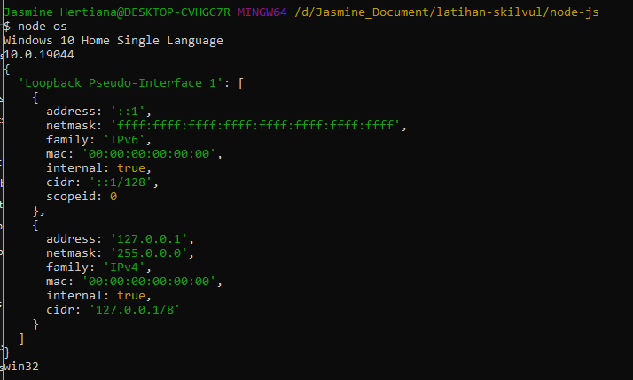
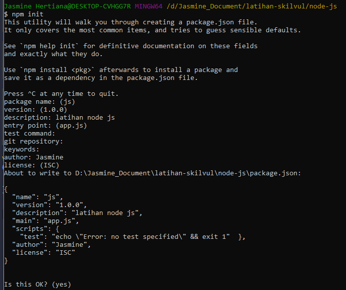
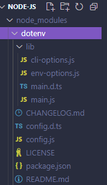
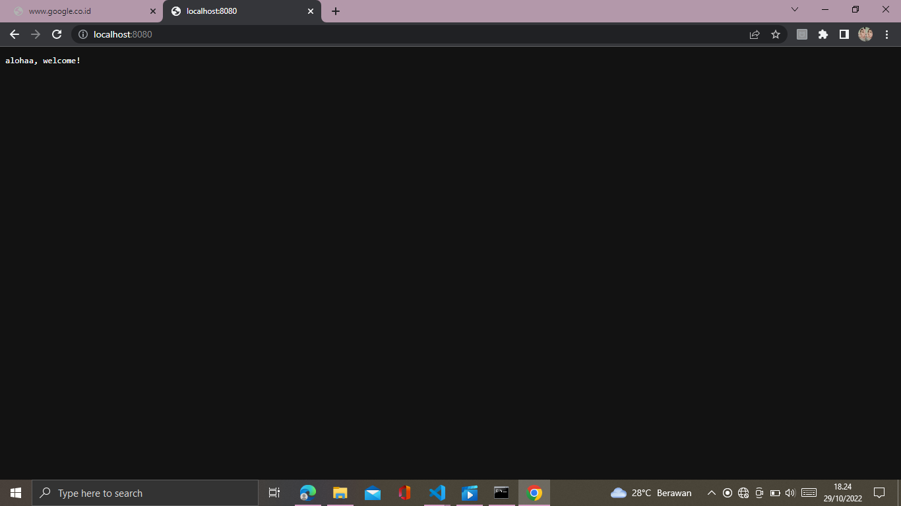

# **Writing Week 5**
## **Web Server dan RESTful API**

### **Komponen Web Server**
<div align="justify">

- **Hardware**, web server sebagai computer yang menyimpan dan mengumpulkan software web server dan file komponen website (HTML, gambar, CSS, dan file JavaScript) yang terkoneksi internet dan mendukung data fisik dan perangkat lain terkoneksi web
- **Software**, web server termasuk beberapa bagian yang mengontrol bagaimana pengguna web mengakses hosted file. dengan menggunakan HTTP Server.

### **Perbedaan Static Web Server dan Dynamic Web Server**

- **Static Web Server**, merujuk pada komputer (hardware) dengan HTTP server (software), disebut statis karena server mengirim hosted file tersebut ke browser.
- **Dynamic Web Server**, merujuk pada static web server dengan software lainnya, biasanya sebuah application server dan database. Disebut dinamis karena application server dapat mengupdate hosted file sebelum mengirim konten ke browser dengan HTTP server.

### **Client-Side dan Server-Side**

- **Client-side**, dari sisi user yang menggunakan browser yang sudah dinamis dan mengirimkan HTTP request ke server agar dapat terproses sebuah aplikasi. Setelah itu, client mendapatkan HTTP response dari request ke server tersebut.
- **Server-side** menerima dan memproses HTTP request dan mengirim HTTP response ke client-side. server-side dapat :

    - mengefisiensi penyimpanan dan mengirim informasi atau konten
    - meningkatkan user experience dengan menyediakan layanan yang memiliki kemudahan 
    - mengontrol akses suatu konten
    - server dapat menyimpan informasi user saat ini dan mengirim response yang berbeda berdasarkan, contohnya fitur histori
    - sebagai fitur notifikasi dan komunikasi live chat. serta membantu data analysis dengan menyediakan data yang diminta.

### **Server-Side Programming**

- **static site**, yang mengembalikan konten hard-coded sama dari server kapanpun sumber data tertentu di request client-side. ketika user ingin menavigasi halaman, browser mengirim HTTP dengan GET request terkait url tsb.
- **Dynamic Site**, dapat mengembalikan data yang berbeda dalam sebuah URL berdasarkan informasi yang tersedia oleh user atau preferensi yang tersimpan dan dapat ditampilan operasi-operasi lain sebagai bagian dari mengembalikan response (contoh : mengirim notifikasi)

### **RESTful API**
<div align="justify">REST adalah singkatan dari Representational State Transfer yang merupakan style arsitektural untuk menyediakan standar diantara sistem komputer di web, mempermudah sistem-sistem untuk komunikasi, standar atau rules dari REST sebagai berikut :

1. uniform interface
2. client-server
3. stateless
4. cacheable
5. layered system
6. code on demand (optional)

code dari sisi client bisa berubah kapan saja tanpa berdampak dengan operasi dalam server, dan code dari sisi server dapat berubah tanpa berdampak dengan operasi dalam client (pemisahan antara front-end dan back-end) yang meruoakan kebalikan dari monolith dimana sisi client dan server tidak dipisah. oleh karena itu sistem monolith, apabila salah satu berubah atau rusak berdampak pada semuanya.
api yang menerapkan standar arsitektur milik REST disebut RESTful API

### **Interaksi antara Client dan Server**
<div align="justify">pada arsitektur REST, client membuat request ke server sebagai permintaan untuk mengambil maupun modifikasi data menjadi langkah awal interaksi. sebuah request terdiri dari :

- ### **HTTP method/verb**
    yang mendefinisikan jenis operasi apa yang ingin digunakan/ditampilkan, terdiri dari :
    
    - GET, mengambil data baik secara spesifik berdasarkan identifier ataupun keseluruhan semua data
    - POST, menambahkan data baru
    - DELETE, menghapus data secara spesifik berdasarkan identifier
    - PUT, mengupdate data secara spesifik berdasarkan identifier, dapat mengedit sebagian ataupun replace secara keseluruhan.
    - PATCH (partial), mengupdate sebagian data secara spesifik berdasarkan identifier

- ### **Header**
    yang dapat digunakan client untuk menyampaikan info mengenai/tentang requestnya. dalam menerima parameter maupun header, contoh :

    ```
    GET /users/20
    Accept: text/html, application/xhtml
    ```

    client mengakses data dengan id 20 pada data users di server dengan mengirim GET request. pada Header fields menyatakan client ingin akan menerima konen dalam bentuk text/html atau application/xhtml


-  ### **Path**
    sebuah path ke sumber data nya, menggunakan endpoint kata benda, contoh penamaan path

    ```
    collection (plural) mengakses seluruh data
    bentuk : 

    https://skilvulstore.api/customers

    singleton (singular) mengakses data tertentu berdasarkan identifier, bentuk :

    https://skilvulstore.api/customers/{id customer}
    https://skilvulstore.api/customers/20

    apabila lebih dari satu kata gunakan strip ( - ) dan huruf kecil semua

    https://skilvulstore.api/customer-histories
    ```

- **pesan di body mengenai isi data (opsional)**

<div align="justify">setelah client mengirimkan request, server menerima dan memproses request, server mengirim response :

- ### **HTTP Response**
    Contoh bentuk response :

    ```
    GET /users/23 HTTP/1.1
    Accept: text/html, application/xhtml
    ```

    maka server akan mengirimkan conten dengan response header berikut :

    ```
    HTTP/1.1 200 (OK)
    Content-Type: text/html
    ```

    **Response Code** yang ditampilkan secara umum terdiri dari :

    - 200 (OK) => standar response untuk HTTP request yang sukses
    - 201 (CREATED) =>  response sbuah HTP request biasanya POST dimana hasil dari item berhasil dibuat atau ditambahkan
    - 204 (NO CONTENT) => response sbuah HTP request biasanya DELETE dimana hasil dari item berhasil dihapus dan tidak tampil
    - 400 (BAD REQUEST)
    - 403 (FORBIDDEN) => user tidak dapat mengakses walaupun data user terdata, karena adanya authorization
    - 404 (NOT FOUND) => data atau konten tidak ditemukan atau belum ada
    - 500 (INTERNAL SERVICE ERROR)

    pada tipe response 2xx (tandanya suatu request berhasil), pada tipe response 3xx (tandanya suatu request redirecting), pada tipe response 4xx (tandanya suatu request tidak berhasil karena client-side error), pada tipe response 5xx (tandanya suatu request tidak berhasil karena server-side error),

&nbsp;
## **Intro Node JS**

<div align="justify"> JavaScript runtime atau tempat menjalankan dan mengeksekusi kode yang dibangun pada JavaScript engine bernama V8 di miliki chrome. pada node js dapat dibuat command line tool, web app, REST API dan mobile app

### **Node JS Architecture**

- **Single Thread**, thread adalah setiap unit yang mampu mengeksekusi kode. Javascript menggunakan konsep single thread, yang berarti hanya memiliki satu tumpukan panggilan yang digunakan untuk menjalankan program dengan menggunakan call stack untuk manajememnnya
- **Even Loop**, javascript dapat menggunakan multi thread yang terdapat enevt queue yang berguna sebagai penampung ketika terdapat perintah baru yang akan dieksekusi. Event loop akan memfasilitasi kondisi ini, event loop akan 
memeriksa terus menerus, ketika antrian kosong di call stack maka akan menambah antrian baru dari event queue sampai semua perintah selesai di eksekusi.
- **Server Side Scripting**, untuk menampilkan hasil eksekusi javascript biasanya hanya bisa di browser, dengan Node JS dapat menjalankan javascript di server side dengan terminal command line perintah "node"

### **Javascript pada Node JS**

sintaks atau code pada bahasa pemrograman Javascript yang sering ditemui pada saat menggunakan Node JS :

- **Arrow Expression**

    ```javascript
    // function biasa tanpa arrow expression
    function panjangArray(nilai1, nilai2) {
        return nilai1.length + nilai2.length
    }
    // function dengan arrow expression
    let panjangArray = (nilai1, nilai2) => return nilai1.length + nilai2.length
    ```

- **Asynchronous**,  mengeksekusi code tanpa berurutan dengan cara “skip” code dan mengeksekusi code selanjutnya dan mencegah blocking.

    ```javascript
    console.log("welcome")
    setTimeout(() => { console.log('on my journal')}, 200) //tunda selama 200 milisecond
    console.log("viewer")
    /*
    output :
    welcome
    viewer
    on my journal */
    ```

- **JSON**,  Javascript Object Notation untuk menyimpan dan mengirim data menggunakan object di JS. dan bahasa pemrograman lain

    ```javascript
    {"items" : [
        {"productName" : "fishes", "weight" : "50kg"},
        {"productName" : "shrimps", "weight" : "10kg"}
    ]}
    ```
### **Build In Node JS for Back End**

- **Console**, module bawaan dari javascript yang ada di node JS untuk digunakan sebagai debug atau menampilkan code secara interface

    ```javascript
    // running lewat terminal tanpa perlu buat file html
    console.log('hai, melati')
    console.log(2*8)
    ```

- **Process**, modules yang digunakan untuk 
menampilkan dan mengontrol prosess Node JS yang sedang dijalankan, gunanya untuk konfigurasi, misal menambahkan file .env dan menyimpan data konfigurasi yang tidak bisa dilihat umum

    ```
    //pembuatan file .env untuk membuat variabel environment sendiri
    //pada file .env terdapat code :
    CLIENT_URL = http://localhost:8500 
    ```

    ```javascript
    // import
    const { env } = require ("process");
    // atau import process from "process"
    const process = require ("process")
    // misal cukup buat global variabel baru tanpa import
    process.env.TOKEN_KEY = "key-token"

    console.log(process.env);
    console.log(env);
    // pemanggilan variabel CLIENT_URL 
    console.log(process.env.CLIENT_URL) //OUTPUT : undefined
    //output undefined karena belum mempunya library tambahan untuk membaca variabel yang ada pada file .env

    //pemanggilan tanpa import 
    process.env.TOKEN_KEY = "kf-token"
    console.log(process.env.TOKEN_KEY); //OUTPUT : key-token
    ```


- **OS**, menyediakan informasi mengenai sistem operasi desktop device yang digunakan

    ```javascript
    // import
    const OS = require('os')
    // mengetahui versi OS dan rilis
    console.log(OS.version())
    console.log(OS.release())

    //ambil alamat IP  untuk lokal IP
    console.log(OS.networkInterfaces());

    //ambil platform contoh "win32"
    console.log(OS.platform());
    ```

    


- **FS**, membantu berinteraksi dengan file yang ada diluar code. FS paling sering digunakan untuk membaca file dengan ekstensi .txt, .csv, dan .json

    ```javascript
    const { fs } = require("fs");

    // Membaca sebuah file
    fs.readFile(".env", (err, data) => {
        // data yang di tampilkan bentuk binary, ubah ke string
        console.log(data.toString())
    })
    // output : CLIENT_URL = http://localhost:8500 

    // hapus atau atur isi filenya ada berapa data/kata
    fs.truncate(".env", 2, () => {
        console.log("isi file .env sisa 2 kata")
    })
    // output (pada file .env) : CL
    ```

    

- **Util**, alat bantu / utilities untuk 
mendukung kebutuhan internal API di Node JS

    ```javascript
    // tujuan lebih untuk debugging
    //impor
    const util = require('util')

    // %s untuk string, %d untuk number
    // tujuan untuk formating dan print
    console.log(util.format('%s %d', "jasmine", 19))

    //atau dipisah dengan buat variabel sendiri
    const nama = "jasmine"
    const umur = 19

    console.log(util.format('%s %d', nama, umur))

    /*
    $ node util
    jasmine 19
    */
    ```

- **Events**

    ```javascript
    const EventEmitter = require("events")

    // proses buat instansi 
    const event = new EventEmitter()

    // dibawah ini biasanya digunakan pada sistem live chat untuk lempar2an event agar dinamis dan time stream
    //membaca/mendengar event
    event.on('connected', () => {
        console.log('user connected');
    })
    // memancarkan/ yang bicara evemt
    event.emit('connected')

    // contoh 2
    //membaca/mendengar event
    event.on('connected', (userName) => {
        console.log('user connected', userName);
    })
    // memancarkan/ yang bicara evemt
    event.emit('connected', "Jasmine")

    // contoh 3
    //membaca/mendengar event
    event.on('connected', (params) => {
        console.log('user connected', params.userName);
    })
    // memancarkan/ yang bicara evemt
    event.emit('connected', {
        userName: "jasmine"
    })
    ```

### **Library pada NPM**

- **Inisialisasi**, inisialisasi npm ``` $ npm init ``` dan isi input untuk detail package 

    

- **Package.JSON**, Maka akan ada file baru bernama package.json, dengan isinya sebagai berikut :

    ```javascript
    {
        "name": "js",
        "version": "1.0.0",
        "description": "latihan node js",
        "main": "app.js",
        "scripts": {
            "test": "echo \"Error: no test specified\" && exit 1"
        },
        "author": "Jasmine",
        "license": "ISC"
    }
    ```

- **Instalasi** instal library via terminal ```npm install dotenv``` atau ```npm i dotenv``` dienter dan akan terinstalasi sebagai berikut di terminal :

    ```
    added 1 package, and audited 2 packages in 5s

    found 0 vulnerabilities
    ```
    jika berhasil terinstall maka akan ada folder berikut :
    &nbsp;
    

    ```javascript
    //package.json
    {
        "name": "js",
        "version": "1.0.0",
        "description": "latihan node js",
        "main": "app.js",
        "scripts": {
            "test": "node events"
        },
        "author": "Jasmine",
        "license": "ISC",
        // library yang terinstal akan disimpan pada dependencies
        "dependencies": {
            "dotenv": "^16.0.3"
        }
    }
    ```

- **node dengan library npm**, contoh pada file process.js dengan build in process dimana mengakses variabel CLIENT_URL yang ada pada file .env

    ```javascript
    require('dotenv').config();
    console.log(process.env.CLIENT_URL) //OUTPUT : http://localhost:8500
    ```

### **Node JS Web Server**
<div align="justify">built-in modul yang disebut HTTP, memungkinkan Node JS mentransfer data melalui Hyper Text Transfer Protocol (HTTP) serta dapat membuat server HTTP yang mendengarkan port server dan memberikan respons kembali ke klien

```javascript
const http = require('http');

//membuat server
// create server menggunakan callback
// request : apa yang diminta user
// response : balasan dari request
http.createServer((request, response) => {
    response.write("alohaa, welcome!")
    //mengakhiri eksekusi, apabila tidak diberikan reponse.end() maka status port di browser akan loading terus
    response.end()
    //fungsi request pada create server contohnya query : localhost:8080/user?nama=jasmine
}).listen(8080, () => {
    //port mana yg akan didengar/buat & diperlukan pengecekan port apakah sedang dipakai agar tidak bentrok
    console.log("server is running at http://localhost:8080")
})
```
pada terminal :

```
$ node app

server is running at http://localhost:8080
```
