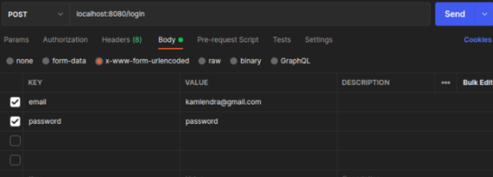
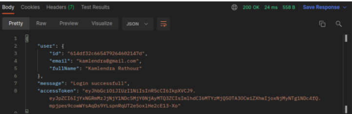

# **Writing Week 6 (Backend Week 2)**
## **MySQL Basic**
### **Database**
<div align='justify'>sebuah set data yang tersimpan di dalam sebuah komputer. Data tersebut biasanya memiliki struktur agar data dapat mudah di akses dan diolah. serta tempat untuk menyimpan data koleksi yang terstruktur didalamnya terdapat informasi dan data bersifat elektronik, salah satu cara mengkoneksikannya dengan DBMS (database management system) yang berbasis SQL (structured query language) dalam penulisan dan pembuatan query data. 

**DBMS**, sistem penorganisasian dan sistem pengolahan Database pada komputer. DBMS atau database management system ini merupakan perangkat lunak (software) yang dipakai untuk membangun basis data yang berbasis komputerisasi.

### **Relational Database**
<div align='justify'> kumpulan item data yang saling terhubung dan relasi atau hubungannya telah ditentukan sebelumnya. disusun dalam set tabel dengan kolom dan baris. sebuah tabel memiliki relasi dan hubungan dengan tabel lain begitupun sebaliknya.

- **ciri-ciri** :
    - Semua entry / elemen data pada suatu baris dan kolom tertentu harus mempunyai nilai tunggal (single value)
    - suatu nilai yang tidak dapat dibagi lagi (atomic value), 
    - bukan suatu kelompok pengulangan, dll

- **Tujuan**, menyediakan metode deklaratif untuk menspesifikasikan data dan kueri: pengguna secara langsung menyatakan bahwa informasi dari database mengandung informasi apa dan informasi yang diinginkan, serta membiarkan sistem software manajemen database mengatur struktur data

- **RDBMS**, SQL server adalah sistem manajemen database relasional atau disingkat RDBMS besutan Microsofft. Mirip dengan produk pasaran RDBMS lainnya, SQL server ini dibangun di atas SQL yakni, bahasa pemrograman standar untuk berinteraksi dengan database relasional. Cara Kerja RDBMS : 
    - Setiap sistem akan memiliki jumlah tabel yang berbeda-beda dengan setiap tabel memiliki unique primary key (kunci primer) yang unik. Lalu, kunci utama tersebut kemudian digunakan untuk mengidentifikasi setiap tabel yang ada.


### **MySQL**
<div align='justify'> Adalah sistem manajemen database relasional (Relational Database Management System) yang merupakan turunan salah satu konsep utama dalam querying database yaitu SQL, selain MySQL juga ada : PostgreSQL, MariaDB, oracle, dll. Keistimewaan MySQL :

- Dapat Digunakan banyak user, MySQL dapat digunakan oleh beberapa pengguna dalam waktu yang bersamaan tanpa mengalami masalah / konflik.
- Compatible dan portabilitasnya, MySQL dapat berjalan stabil pada berbagai sistem operasi seperti Windows, Linux, MacOS dll

### **Tipe Data MySQL**
- **Number**, Kumpulan karakter angka
    - **Int**, Angka bulat seperti 1, 22, 1009, dll. memiliki range dari `-2,147,483,648` sampai `2,147,483,647`.
    - **Float**, Angka yang menggunakan koma, namun penulisannya dalam dokumentasi menjadi titik (.), seperti : 3.14, 90.78, dll. memiliki range dari `-3.402823466E+38` sampai `3.402823466E+38`
    - **Decimal**, angka pecahan, jumlah angka pecahan dibelakang koma sudah di setting atau ditentukan dari awal misal 2 angka, dll. range decimal (4,1) total 4 angka dengan 1 angka dibelakang koma `-999,9` sampai `999,9`. range decimal (3,2) total 3 angka dengan 2 angka dibelakang koma `-9,99` sampai `9,99`. range decimal (6,2) total 6 angka dengan 2 angka dibelakang koma `-9999,99` sampai `9999,99`
- **String**, kumpulan karakter juga simbol karakter
    - **Char**, tipe data string dengan panjang karakter yang sudah ditentukan serta memorinya sesuai panjang karakter yang sudah didefinisikan, biasanya dipakai disuatu kode campuran angka dan karakter, contoh : `char(5)` => `LM-01`
    - **Varchar**, Tipe data string dengan panjang karakter dan memorinya yang fleksibel tersebut maksimal 255, `varchar(255)`, `varchar(50)`, dll. contoh `varchar(20)` => `Jasmine Hertiana`
    - **Text**, Tipe data string dengan penyimpanan yang lebih panjang dari varchar, dalam dokumentasinya tidak perlu ditentukan panjang karakternya cukup `text`
    - **Enum**, tipe data string yang khusus untuk kolom yang memiliki nilai data yang sudah ditentukan. contoh : `enum('Pria', 'Wanita')`, data yang akan tersimpan merupakan salah satu dari nilai yang sudah ditentukan tersebut misal `Wanita`.
- **Boolean**, 2 tipe data yaitu `TRUE` dan `FALSE`, dan konversi integer atau int nya dengan representasi `TRUE = 1`, dan `FALSE = 0`. Biasanya digunakan setelah ada eksekusi perbandingan
- **Date Time**, tipe data yang menyimpan format tanggal dan waktu
    - **DATE**, menyimpan tanggal. Format : `YYYY-MM-DD` => `2003-03-24` yang artinya tanggal 24 bulan Maret tahun 2003
    - **DATETIME**, menyimpan tanggal dan waktu. Format : `YYYY-MM-DD hh:mm:ss` => `2003-03-24 17:30:50` yang artinya tanggal 24 bulan Maret tahun 2003 pukul 17 sore menit 30 detik 50
    - **TIME**, menyimpan waktu. Format : `hh:mm:ss` => `17:30:50` yang artinya pukul 17 sore menit 30 detik 50
    - **timestamp**, menyimpan tanggal dan waktu dan juga UTC nya atau timezone. format : `CCYY-MM-DD hh:mm:ss +00:00`
- **Default**, tipe data yang telah di set atau ditentukan dan diatur untuk nilai defaultnya jika tidak diisi dengan nilai `DEFAULT("Bonjour")`
- **Null**, tipe data yang tidak memiliki isi maupun kosong dan tidak memiliki nilai atau data `NULL`

### **Query MySQL Basic**

- **Primary Key**, seperti namanya primary key sebagai dasar identifikasi untuk membedakan suatu baris/record dengan baris/record lainnya dalam suatu tabel. oleh karena itu primary key bersifat unik, dan setiap tabel hanya boleh memiliki 1 kolom/atribut/field yang merupakan primary key
- **Foreign Key** adanya foreign key membuktikan bahwa sebuah database tersebut memiliki pengolahan RDBMS. Foreign key adalah suatu atribut/kolom/field yang direferensikan dari primary key suatu atribut/kolom/field pada tabel lain untuk menciptakan hubungan/relasi antara dua tabel.

#### **DDL (Data Definition Language)**
- **membuat database baru**
    ```
    mysql> CREATE DATABASE peminjaman;
    Query OK, 1 row affected (0.19 sec)
    ```

- **melihat database yang ada**
    ```
    mysql> SHOW DATABASES;
    +--------------------+
    | Database           |
    +--------------------+
    | information_schema |
    | mysql              |
    | peminjaman         |
    | performance_schema |
    | perpustakaan       |
    | sakila             |
    | sys                |
    | world              |
    +--------------------+
    7 rows in set (0.00 sec)
    ```

- **menggunakan database yang sudah ada**
    ```
    mysql> USE peminjaman
    Database changed
    mysql>
    ```

- **menghapus / menghilangkan database yang dipilih dari MySQL**
    ```
    mysql> DROP DATABASE perpustakaan;
    Query OK, 0 rows affected (0.12 sec)

    mysql> SHOW DATABASES;
    +--------------------+
    | Database           |
    +--------------------+
    | information_schema |
    | mysql              |
    | peminjaman         |
    | performance_schema |
    | sakila             |
    | sys                |
    | world              |
    +--------------------+
    7 rows in set (0.04 sec)
    ```

- **membuat table baru** pada database peminjaman
    ```
    mysql> CREATE TABLE peminjaman_perpustakaan (
        -> id INT(5) AUTO_INCREMENT PRIMARY KEY,
        -> nama_anggota VARCHAR(50) NOT NULL,
        -> tanggal_pinjam DATE NOT NULL,
        -> nama_pengurus VARCHAR(50),
        -> judul_buku VARCHAR(20) NOT NULL,
        -> kode_buku CHAR(5));
    Query OK, 0 rows affected, 1 warning (0.29 sec)
    ```

- **melihat semua table di database peminjaman**
    ```
    mysql> SHOW TABLES;
    +-------------------------+
    | Tables_in_peminjaman    |
    +-------------------------+
    | denda                   |
    | peminjaman_perpustakaan |
    +-------------------------+
    2 rows in set (0.11 sec)
    ```

- **menghapus Tabel**
    ```
    mysql> DROP TABLES denda;
    Query OK, 0 rows affected (0.17 sec)

    mysql> SHOW TABLES;
    +-------------------------+
    | Tables_in_peminjaman    |
    +-------------------------+
    | peminjaman_perpustakaan |
    +-------------------------+
    1 row in set (0.00 sec)
    ```

- **manipulasi kolom di table yang dipilih**
    ```
    mysql> ALTER TABLE peminjaman_perpustakaan
        -> ADD alamat_anggota VARCHAR(255);
    Query OK, 0 rows affected (0.23 sec)
    Records: 0  Duplicates: 0  Warnings: 0

    mysql> ALTER TABLE peminjaman_perpustakaan
        -> DROP COLUMN kode_buku;
    Query OK, 0 rows affected (0.07 sec)
    Records: 0  Duplicates: 0  Warnings: 0
    ```

#### **DML (Data Manipulation Language)**
- **menambah data/record**
    ```
    mysql> INSERT INTO peminjaman_perpustakaan
        -> (id, nama_anggota, tanggal_pinjam, nama_pengurus, judul_buku, alamat_anggota)
        -> VALUES
        -> (1, 'jasmine', '2022-03-03', 'haqi', 'kalkulus', 'Bekasi'),
        -> (2, 'mine', '2022-05-03', 'abay', 'accurate', 'Tambun'),
        -> (3, 'yasmin', '2022-05-12', 'ghani', 'accounting', 'Mekarsari');
    Query OK, 3 rows affected (0.03 sec)
    Records: 3  Duplicates: 0  Warnings: 0
    ```
- **melihat isi seluruh data di table yang dipilih**
    ```
    mysql> SELECT * FROM peminjaman_perpustakaan;
    +----+--------------+----------------+---------------+------------+----------------+
    | id | nama_anggota | tanggal_pinjam | nama_pengurus | judul_buku | alamat_anggota |
    +----+--------------+----------------+---------------+------------+----------------+
    |  1 | jasmine      | 2022-03-03     | haqi          | kalkulus   | Bekasi         |
    |  2 | mine         | 2022-05-03     | abay          | accurate   | Tambun         |
    |  3 | yasmin       | 2022-05-12     | ghani         | accounting | Mekarsari      |
    +----+--------------+----------------+---------------+------------+----------------+
    3 rows in set (0.00 sec)
    ```

- **melihat isi data tertentu di table yang dipilih**
    ```
    mysql> SELECT id, nama_anggota, tanggal_pinjam FROM peminjaman_perpustakaan;
    +----+--------------+----------------+
    | id | nama_anggota | tanggal_pinjam |
    +----+--------------+----------------+
    |  1 | jasmine      | 2022-03-03     |
    |  2 | mine         | 2022-05-03     |
    |  3 | yasmin       | 2022-05-12     |
    +----+--------------+----------------+
    3 rows in set (0.00 sec)
    ```

- **melihat isi data tertentu di table yang dipilih menggunakan alias / AS untuk mengubah nama kolom**
    ```
    mysql> SELECT judul_buku AS "Sedang Dipinjam" FROM peminjaman_perpustakaan;
    +-----------------+
    | Sedang Dipinjam |
    +-----------------+
    | kalkulus        |
    | accurate        |
    | accounting      |
    +-----------------+
    3 rows in set (0.00 sec)
    ```

- **melihat isi data tertentu di table yang dipilih dengan pengkondisian**
    ```
    mysql> SELECT * FROM peminjaman_perpustakaan WHERE id = 3;
    +----+--------------+----------------+---------------+------------+----------------+
    | id | nama_anggota | tanggal_pinjam | nama_pengurus | judul_buku | alamat_anggota |
    +----+--------------+----------------+---------------+------------+----------------+
    |  3 | yasmin       | 2022-05-12     | ghani         | accounting | Mekarsari      |
    +----+--------------+----------------+---------------+------------+----------------+
    1 row in set (0.00 sec)

    mysql> SELECT * FROM peminjaman_perpustakaan WHERE id IN (2,3);
    +----+--------------+----------------+---------------+------------+----------------+
    | id | nama_anggota | tanggal_pinjam | nama_pengurus | judul_buku | alamat_anggota |
    +----+--------------+----------------+---------------+------------+----------------+
    |  2 | mine         | 2022-05-03     | abay          | accurate   | Tambun         |
    |  3 | yasmin       | 2022-05-12     | ghani         | accounting | Mekarsari      |
    +----+--------------+----------------+---------------+------------+----------------+
    2 rows in set (0.03 sec)

    mysql> SELECT * FROM peminjaman_perpustakaan WHERE id = 3 AND nama_pengurus = 'ghani';
    +----+--------------+----------------+---------------+------------+----------------+
    | id | nama_anggota | tanggal_pinjam | nama_pengurus | judul_buku | alamat_anggota |
    +----+--------------+----------------+---------------+------------+----------------+
    |  3 | yasmin       | 2022-05-12     | ghani         | accounting | Mekarsari      |
    +----+--------------+----------------+---------------+------------+----------------+
    1 row in set (0.00 sec)

    mysql> SELECT * FROM peminjaman_perpustakaan WHERE id = 3 OR nama_pengurus = 'haqi';
    +----+--------------+----------------+---------------+------------+----------------+
    | id | nama_anggota | tanggal_pinjam | nama_pengurus | judul_buku | alamat_anggota |
    +----+--------------+----------------+---------------+------------+----------------+
    |  1 | jasmine      | 2022-03-03     | haqi          | kalkulus   | Bekasi         |
    |  3 | yasmin       | 2022-05-12     | ghani         | accounting | Mekarsari      |
    +----+--------------+----------------+---------------+------------+----------------+
    2 rows in set (0.00 sec)

    mysql> SELECT * FROM peminjaman_perpustakaan WHERE NOT alamat_anggota = 'Bekasi';
    +----+--------------+----------------+---------------+------------+----------------+
    | id | nama_anggota | tanggal_pinjam | nama_pengurus | judul_buku | alamat_anggota |
    +----+--------------+----------------+---------------+------------+----------------+
    |  2 | mine         | 2022-05-03     | abay          | accurate   | Tambun         |
    |  3 | yasmin       | 2022-05-12     | ghani         | accounting | Mekarsari      |
    +----+--------------+----------------+---------------+------------+----------------+
    2 rows in set (0.00 sec)

    mysql> SELECT * FROM peminjaman_perpustakaan WHERE NOT alamat_anggota = 'Bekasi'
        -> ORDER BY tanggal_pinjam DESC;
    +----+--------------+----------------+---------------+------------+----------------+
    | id | nama_anggota | tanggal_pinjam | nama_pengurus | judul_buku | alamat_anggota |
    +----+--------------+----------------+---------------+------------+----------------+
    |  3 | yasmin       | 2022-05-12     | ghani         | accounting | Mekarsari      |
    |  2 | mine         | 2022-05-03     | abay          | accurate   | Tambun         |
    +----+--------------+----------------+---------------+------------+----------------+
    2 rows in set (0.00 sec)
    ```

- **melakukan perbaruan data/record**
    ```
    mysql> UPDATE peminjaman_perpustakaan SET judul_buku = 'python programs' WHERE nama_anggota = 'mine';
    Query OK, 1 row affected (0.07 sec)
    Rows matched: 1  Changed: 1  Warnings: 0

    mysql> SELECT * FROM peminjaman_perpustakaan WHERE nama_anggota = 'mine';
    +----+--------------+----------------+---------------+-----------------+----------------+
    | id | nama_anggota | tanggal_pinjam | nama_pengurus | judul_buku      | alamat_anggota |
    +----+--------------+----------------+---------------+-----------------+----------------+
    |  2 | mine         | 2022-05-03     | abay          | python programs | Tambun         |
    +----+--------------+----------------+---------------+-----------------+----------------+
    1 row in set (0.00 sec)
    ```

- **melakukan penghapusan data**, menggunakan WHERE agar tidak terhapus semua data
    ```
    mysql> DELETE FROM peminjaman_perpustakaan WHERE nama_anggota = 'mine';
    Query OK, 1 row affected (0.07 sec)

    mysql> SELECT * FROM peminjaman_perpustakaan;
    +----+--------------+----------------+---------------+------------+----------------+
    | id | nama_anggota | tanggal_pinjam | nama_pengurus | judul_buku | alamat_anggota |
    +----+--------------+----------------+---------------+------------+----------------+
    |  1 | jasmine      | 2022-03-03     | haqi          | kalkulus   | Bekasi         |
    |  3 | yasmin       | 2022-05-12     | ghani         | accounting | Mekarsari      |
    +----+--------------+----------------+---------------+------------+----------------+
    2 rows in set (0.00 sec)
    ```

&nbsp;
## **MySQL Lanjutan**
### **Menentukan Relasi antar Entity / Tabel**
<div align='justify'>sebuah studi kasus sederhana layanan perpustakaan dimana memiliki entity Buku, Anggota, dan Rak. 


- 1 buku ditempatkan di 1 rak, sebaliknya 1 rak dapat ditempatkan banyak buku. Relasi nya `one to many` atau `many to one`
- 1 anggota dapat meminjam banyak buku, sebaliknya 1 buku dapat dipinjam beberapa / berulang kali oleh beberapa anggota. Relasi nya `Many to Many`
- Relasi antara anggota dan buku (meminjam) dapat menjadi entity baru, yaitu entity peminjaman, seperti berikut :


- warna `merah` adalah `primary key`. warna `biru` adalah `foreign key`
- relasi antar anggota dan buku yang tadinya `Many to Many`, karena adanya entity baru yang asalnya dari relation meminjam menjadi entity peminjaman. relasi anggota dengan peminjaman adalah `one to many` sama halnya relasi buku dengan peminjaman.


### **Normalisasi**
<div align='justify'>Teknik mengelompokkan dan mengorganisasikan atribut/kolom/field data sehingga terbentuk suatu entitas, yang terhindar dari anomali. 

- **Tujuan :**
    - terciptanya non-redundan data pada suatu database
    - efisien dalam adanya perubahan struktur tabel/entity suatu database
    - meminimalisir dampak apabila ada perubahan struktur tabel/entity suatu database.

- **Dampak TIDAK menggunakan Normalisasi :**
    - INSERT Anomali : tidak dapat memasukkan beberapa data secara langsung
    - DELETE Anomali : Penhapusan data tidak efektif dan tidak sesuai ekspektasi
    - UPDATE Anomali : data yang diubah terjadi inkonsistensi dalam database dan tidak efektif serta tidak sesuai ekspektasi.

- **Bentuk Umum Normalisasi :**
    - **1NF**. Dimana Setiap kolom bernilai tunggal (single value), memiliki nama yang unik. untuk menghilangkan adanya data ganda atau multiple value pada atribut sebuah entity.
    - **2NF**. Dimana sudah berbentuk 1NF, subset data yang terdapat pada entity dihapus dan diberikan aatribut terpisah.
    - **3NF**. Dimana seluruh field/atribut/kolom yang tidak ada relasi atau hubungan dengan primary key dihilangkan. dan tidak adanya ketergantungan transitif, dimana suatu kolom tergantung dengan kolom lain (selain primary key)

### **Query MySQL Tingkat Lanjut**
<div align='justify'> menyiapkan tabel yang sudah memiliki atribut dan record :

```
mysql> select * from buku;
+---------+--------------------------------+--------+------------+
| id_buku | judul_buku                     | id_rak | harga_buku |
+---------+--------------------------------+--------+------------+
|       1 | Udah Putusin Aja               | H      |      55000 |
|       2 | How to make aesthetic painting | S      |      43000 |
|       3 | How to make gorgeous art       | S      |      67000 |
|       4 | accounting intermediate        | P      |     105000 |
+---------+--------------------------------+--------+------------+
4 rows in set (0.00 sec)

mysql> SELECT * FROM anggota;
+------------+------------------+---------------+
| id_anggota | nama_anggota     | lokasi        |
+------------+------------------+---------------+
|          1 | jasmine hertiana | Tambun        |
|          2 | atika dwi        | Griya asri    |
|          3 | regy aprilia     | Jalan aries   |
|          4 | randomi personi  | Planet Bekasi |
+------------+------------------+---------------+
4 rows in set (0.00 sec)

mysql> select * from rak;
+--------+------------+--------------------+
| id_rak | nama_rak   | lokasi             |
+--------+------------+--------------------+
| H      | Hiburan    | Baris 5 Tenggara   |
| S      | Seni       | Baris 4 Barat Laut |
| P      | Pendidikan | Baris 1 Timur Laut |
+--------+------------+--------------------+
3 rows in set (0.00 sec)

mysql> select * from peminjaman;
+-----------+----------------+------------+---------+
| id_pinjam | tanggal_pinjam | id_anggota | id_buku |
+-----------+----------------+------------+---------+
|         1 | 2022-03-24     |          2 |       4 |
|         2 | 2022-10-25     |          2 |       3 |
|         3 | 2022-10-01     |          1 |       2 |
|         4 | 2022-10-21     |          3 |       3 |
+-----------+----------------+------------+---------+
4 rows in set (0.00 sec)
```

- ### **Join Multiple Tables**
    ambil records dari dua atau lebih table database yang memiliki hubungan atau relasi, dan ditampilkan dalam satu set data.

    - **Inner Join**, semua baris diambil dari kedua tabel yang saling terelasi yang akan di JOIN selama masing kolom cocok dengan kondisinya

        ```
        mysql> SELECT * FROM buku INNER JOIN rak ON buku.id_rak = rak.id_rak;
        +---------+--------------------------------+--------+------------+--------+------------+--------------------+
        | id_buku | judul_buku                     | id_rak | harga_buku | id_rak | nama_rak   | lokasi             |
        +---------+--------------------------------+--------+------------+--------+------------+--------------------+
        |       1 | Udah Putusin Aja               | H      |      55000 | H      | Hiburan    | Baris 5 Tenggara   |
        |       2 | How to make aesthetic painting | S      |      43000 | S      | Seni       | Baris 4 Barat Laut |
        |       3 | How to make gorgeous art       | S      |      67000 | S      | Seni       | Baris 4 Barat Laut |
        |       4 | accounting intermediate        | P      |     105000 | P      | Pendidikan | Baris 1 Timur Laut |
        +---------+--------------------------------+--------+------------+--------+------------+--------------------+
        4 rows in set (0.01 sec)

        mysql> SELECT * FROM peminjaman INNER JOIN buku ON peminjaman.id_buku = buku.id_buku;
        +-----------+----------------+------------+---------+---------+--------------------------------+--------+------------+
        | id_pinjam | tanggal_pinjam | id_anggota | id_buku | id_buku | judul_buku                     | id_rak | harga_buku |
        +-----------+----------------+------------+---------+---------+--------------------------------+--------+------------+
        |         1 | 2022-03-24     |          2 |       4 |       4 | accounting intermediate        | P      |     105000 |
        |         2 | 2022-10-25     |          2 |       3 |       3 | How to make gorgeous art       | S      |      67000 |
        |         3 | 2022-10-01     |          1 |       2 |       2 | How to make aesthetic painting | S      |      43000 |
        |         4 | 2022-10-21     |          3 |       3 |       3 | How to make gorgeous art       | S      |      67000 |
        +-----------+----------------+------------+---------+---------+--------------------------------+--------+------------+
        4 rows in set (0.00 sec)

        mysql> SELECT * FROM peminjaman INNER JOIN anggota ON peminjaman.id_anggota = anggota.id_anggota;
        +-----------+----------------+------------+---------+------------+------------------+
        | id_pinjam | tanggal_pinjam | id_anggota | id_buku | id_anggota | nama_anggota     |
        +-----------+----------------+------------+---------+------------+------------------+
        |         1 | 2022-03-24     |          2 |       4 |          2 | atika dwi        |
        |         2 | 2022-10-25     |          2 |       3 |          2 | atika dwi        |
        |         3 | 2022-10-01     |          1 |       2 |          1 | jasmine hertiana |
        |         4 | 2022-10-21     |          3 |       3 |          3 | regy aprilia     |
        +-----------+----------------+------------+---------+------------+------------------+
        4 rows in set (0.00 sec)
        ```

    - **Left Join**, semua record data dari entity/tabel disisi kiri JOIN yang akan dipilih, jika record dari tabel kiri tidak punya record cocok maka tabel join kanan, tetap ada namun data nya null.

        ```
        mysql> SELECT * FROM peminjaman LEFT JOIN buku ON peminjaman.id_buku = buku.id_buku;
        +-----------+----------------+------------+---------+---------+--------------------------------+--------+------------+
        | id_pinjam | tanggal_pinjam | id_anggota | id_buku | id_buku | judul_buku                     | id_rak | harga_buku |
        +-----------+----------------+------------+---------+---------+--------------------------------+--------+------------+
        |         1 | 2022-03-24     |          2 |       4 |       4 | accounting intermediate        | P      |     105000 |
        |         2 | 2022-10-25     |          2 |       3 |       3 | How to make gorgeous art       | S      |      67000 |
        |         3 | 2022-10-01     |          1 |       2 |       2 | How to make aesthetic painting | S      |      43000 |
        |         4 | 2022-10-21     |          3 |       3 |       3 | How to make gorgeous art       | S      |      67000 |
        +-----------+----------------+------------+---------+---------+--------------------------------+--------+------------+
        4 rows in set (0.00 sec)

        mysql> SELECT * FROM buku LEFT JOIN rak ON buku.id_rak = rak.id_rak;
        +---------+--------------------------------+--------+------------+--------+------------+--------------------+
        | id_buku | judul_buku                     | id_rak | harga_buku | id_rak | nama_rak   | lokasi             |
        +---------+--------------------------------+--------+------------+--------+------------+--------------------+
        |       1 | Udah Putusin Aja               | H      |      55000 | H      | Hiburan    | Baris 5 Tenggara   |
        |       2 | How to make aesthetic painting | S      |      43000 | S      | Seni       | Baris 4 Barat Laut |
        |       3 | How to make gorgeous art       | S      |      67000 | S      | Seni       | Baris 4 Barat Laut |
        |       4 | accounting intermediate        | P      |     105000 | P      | Pendidikan | Baris 1 Timur Laut |
        +---------+--------------------------------+--------+------------+--------+------------+--------------------+
        4 rows in set (0.00 sec)

        mysql> SELECT * FROM rak LEFT JOIN buku ON buku.id_rak = rak.id_rak;
        +--------+------------+--------------------+---------+--------------------------------+--------+------------+
        | id_rak | nama_rak   | lokasi             | id_buku | judul_buku                     | id_rak | harga_buku |
        +--------+------------+--------------------+---------+--------------------------------+--------+------------+
        | H      | Hiburan    | Baris 5 Tenggara   |       1 | Udah Putusin Aja               | H      |      55000 |
        | S      | Seni       | Baris 4 Barat Laut |       3 | How to make gorgeous art       | S      |      67000 |
        | S      | Seni       | Baris 4 Barat Laut |       2 | How to make aesthetic painting | S      |      43000 |
        | P      | Pendidikan | Baris 1 Timur Laut |       4 | accounting intermediate        | P      |     105000 |
        +--------+------------+--------------------+---------+--------------------------------+--------+------------+
        4 rows in set (0.00 sec)
        ```

    - **Right Join**, semua record data dari entity/tabel disisi kanan JOIN yang akan dipilih, jika record dari tabel kanan tidak punya record cocok maka tabel join kiri, tetap ada namun data nya null.

        ```
        mysql> SELECT * FROM peminjaman RIGHT JOIN buku ON peminjaman.id_buku = buku.id_buku;
        +-----------+----------------+------------+---------+---------+--------------------------------+--------+------------+
        | id_pinjam | tanggal_pinjam | id_anggota | id_buku | id_buku | judul_buku                     | id_rak | harga_buku |
        +-----------+----------------+------------+---------+---------+--------------------------------+--------+------------+
        |      NULL | NULL           |       NULL |    NULL |       1 | Udah Putusin Aja               | H      |      55000 |
        |         3 | 2022-10-01     |          1 |       2 |       2 | How to make aesthetic painting | S      |      43000 |
        |         4 | 2022-10-21     |          3 |       3 |       3 | How to make gorgeous art       | S      |      67000 |
        |         2 | 2022-10-25     |          2 |       3 |       3 | How to make gorgeous art       | S      |      67000 |
        |         1 | 2022-03-24     |          2 |       4 |       4 | accounting intermediate        | P      |     105000 |
        +-----------+----------------+------------+---------+---------+--------------------------------+--------+------------+
        5 rows in set (0.05 sec)

        mysql> SELECT * FROM peminjaman RIGHT JOIN anggota ON peminjaman.id_anggota = anggota.id_anggota;
        +-----------+----------------+------------+---------+------------+------------------+
        | id_pinjam | tanggal_pinjam | id_anggota | id_buku | id_anggota | nama_anggota     |
        +-----------+----------------+------------+---------+------------+------------------+
        |         3 | 2022-10-01     |          1 |       2 |          1 | jasmine hertiana |
        |         2 | 2022-10-25     |          2 |       3 |          2 | atika dwi        |
        |         1 | 2022-03-24     |          2 |       4 |          2 | atika dwi        |
        |         4 | 2022-10-21     |          3 |       3 |          3 | regy aprilia     |
        |      NULL | NULL           |       NULL |    NULL |          4 | randomi personi  |
        +-----------+----------------+------------+---------+------------+------------------+
        5 rows in set (0.00 sec)
        ```

- ### **Aggregate Functions**
    ambil suatu nilai pada suatu pengkodisian setelah adanya perhitungan set value atau kumpulan nilai/data.

    - **MAX**, nilai terbesar dari atribut/field/kolom yang dipilih.
    
        ```
        mysql> SELECT * FROM buku;
        +---------+--------------------------------+--------+------------+
        | id_buku | judul_buku                     | id_rak | harga_buku |
        +---------+--------------------------------+--------+------------+
        |       1 | Udah Putusin Aja               | H      |      55000 |
        |       2 | How to make aesthetic painting | S      |      43000 |
        |       3 | How to make gorgeous art       | S      |      67000 |
        |       4 | accounting intermediate        | P      |     105000 |
        +---------+--------------------------------+--------+------------+
        4 rows in set (0.00 sec)

        mysql> SELECT MAX(harga_buku) FROM buku WHERE id_rak = 'S';
        +-----------------+
        | MAX(harga_buku) |
        +-----------------+
        |           67000 |
        +-----------------+
        1 row in set (0.00 sec)
        ```

    - **MIN**, nilai terkecil dari atribut/field/kolom yang dipilih.

        ```
        mysql> SELECT MIN(harga_buku) FROM buku WHERE id_rak = 'S';
        +-----------------+
        | MIN(harga_buku) |
        +-----------------+
        |           43000 |
        +-----------------+
        1 row in set (0.00 sec)
        ```

    - **SUM**, jumlah total dari kolom bentuk dan secara numerik.
    
        ```
        mysql> SELECT SUM(harga_buku) FROM buku WHERE id_rak = 'S';
        +-----------------+
        | SUM(harga_buku) |
        +-----------------+
        |          110000 |
        +-----------------+
        1 row in set (0.04 sec)
        ```
        
    - **COUNT**, jumlah baris yang cocok dengan pengkondisian atau kriteria tertentu
    
        ```
        mysql> SELECT COUNT(id_buku) FROM buku WHERE harga_buku > 50000;
        +----------------+
        | COUNT(id_buku) |
        +----------------+
        |              3 |
        +----------------+
        1 row in set (0.00 sec)
        ```
        
    - **AVG**, nilai rata-rata dari kolom bentuk dan secara numerik.
        
        ```
        mysql> SELECT AVG(harga_buku) FROM buku WHERE id_rak = 'S';
        +-----------------+
        | AVG(harga_buku) |
        +-----------------+
        |      55000.0000 |
        +-----------------+
        1 row in set (0.01 sec)
        ```
        
- ### **UNION**
    penggabungan set value dari dua atau lebih SELECT statement, tabel-tabel yang memiliki jumlah kolom yang sama dan kolom dengan tipe data yang sama serta urutan yang sama

    ```
    mysql> SELECT lokasi FROM rak UNION SELECT lokasi FROM anggota;
    +--------------------+
    | lokasi             |
    +--------------------+
    | Baris 5 Tenggara   |
    | Baris 4 Barat Laut |
    | Baris 1 Timur Laut |
    | Tambun             |
    | Griya asri         |
    | Jalan aries        |
    | Planet Bekasi      |
    +--------------------+
    7 rows in set (0.05 sec)
    ```

- ### **GROUP BY**
    pengelompokan records yang memiliki value yang sama ke sebuah record yang lebih ringkas, digunakan untuk mengelompokan set value dengan satu atau lebih atribut (fungsi agregat).

    ```
    mysql> SELECT COUNT(id_rak), id_rak FROM buku GROUP BY id_rak;
    +---------------+--------+
    | COUNT(id_rak) | id_rak |
    +---------------+--------+
    |             1 | H      |
    |             2 | S      |
    |             1 | P      |
    +---------------+--------+
    3 rows in set (0.00 sec)
    ```

- ### **HAVING**
    menggunakan kata kunci WHERE yang tidak digunakan dalam fungsi agregat

    ```
    mysql> SELECT id_buku, COUNT(id_pinjam)
        -> FROM peminjaman
        -> GROUP BY id_buku
        -> HAVING COUNT(id_buku)> 1 ;
    +---------+------------------+
    | id_buku | COUNT(id_pinjam) |
    +---------+------------------+
    |       3 |                2 |
    +---------+------------------+
    1 row in set (0.00 sec)
    ```

- ### **LIKE & Wildcards**
    LIKE merupakan operator yang ada pada pengkondisian WHERE untuk mencari pola tertentu pada suatu record dalam atribut tertentu. WILDCARD menggantikan satu atau beberapa karakter dalam bentuk string.

    - **% Wildcards**, karakter %. apabila % didepan karakter, maka tampil data yang query value terakhir. apabila % dibelakang karakter, maka tampil data yang query paling depan. apabila % didepan dan belakang karakter, maka tampil data yang mengandung karakter itu ditengah.

        ```
        mysql> SELECT nama_anggota FROM anggota WHERE nama_anggota LIKE '%mi%' OR '%ni%';
        +------------------+
        | nama_anggota     |
        +------------------+
        | jasmine hertiana |
        | randomi personi  |
        +------------------+
        2 rows in set, 1 warning (0.06 sec)

        mysql> SELECT judul_buku FROM buku WHERE judul_buku LIKE 'How%';
        +--------------------------------+
        | judul_buku                     |
        +--------------------------------+
        | How to make aesthetic painting |
        | How to make gorgeous art       |
        +--------------------------------+
        2 rows in set (0.00 sec)
        ```

    - **_ Wildcards**, mewakili suatu karakter

        ```
        mysql> SELECT judul_buku FROM buku WHERE judul_buku LIKE '%_ow to%';
        +--------------------------------+
        | judul_buku                     |
        +--------------------------------+
        | How to make aesthetic painting |
        | How to make gorgeous art       |
        +--------------------------------+
        2 rows in set (0.00 sec)
        ```

&nbsp;

## **Authentication & Authorization (Express JS Middleware)**

### **Authentication**
<div align='justify'>pemrosesan user baik melalui akses komputer, jaringan maupun secara jarak jauh/remote dalam mendapatkan hak akses terhadap suatu jaringan maupun entity, dalam konteksnya website. user login ke sebuah infrastruktur atau jaringan, lalu sistem mengenali/ mendeteksi user ID dan acc/ terima user tsb serta memberikan akses terhadap sumber daya jaringan sesuai authorization yang dimiliki user itu.

- Metode authentication yang berbasis pada 
**kerahasiaan informasi (Knowledge)** :
    - Password/PIN 
    - Digital Certificate : asymmentric cryptography based mengandung informasi rahasia
    - Private key : Owner yang tahu, user biasa lain hanya tahu Public Key
- Metode authentication yang berbasis pada 
**keunikan (Inherence)** :
    - Retina 
    - Fingerprint
    - foto paspor
    - Tandatangan
    - Voice patterns
- Metode authentication yang berbasis pada 
**user miliki (Posession)** :
    - Phone
    - Smart Card
- **Session Based Authentication**, server membuat session untuk user setelah user login. session id akan disimpan dalam cookie pada browser yang digunakan user. selama user teap dalam keadaan log in, cookie dapat dikirim pada setiap request yang dilakukan user. lalu server melakukan perbandingan dengan session id yang disimpan pada cookie dengan informasi session yang disimpan pada memory untuk memverifikasi identitas user dan mengembalikan respon sesuai dengan status response.
- **Token Based Authentication**, menggunakan JSON Web Token (JWT) dibanding session untuk authentication. pada token based app, server akan membuat JWT dengan rahasia dan mengirim JWT kepada client. Client kemudian menyimpan JWT (biasanya pada local storage) dan memasukkan JWT kedalam headers untuk setiap request yang dilakukan client. server akan memvalidasi JWT pada setiap request client dan mengembalikan response. Perbedaannya, user's state tidak disimpan dalam server, tetapi disimpan dalam token client side. modern web app banyak yang sudah menggunakan JWT untuk authentication proses dengan alasan skalanya (scalability) serta authentication untuk mobile.

### **Authorization**
<div align='justify'> disini user ditentukan apakah diizinkan / ditolak untuk mengakses atau membuat request serta action lainnya terhadap suatu resources infrastruktur tertentu dalam sistem atau jaringan. setelah authentication dimana user login sistem dengan id dan password, kemudian sistem mengenali dan mengeksekusi user untuk mendapatkan akses maupun ditolak terhadap suatu infrastruktur resource sistem. Jadi tanpa authentication tidak ada authorization. namun beberapa sistem ada yang menerapkan pengguna yang tidak ter-otentikasi (anonymous guest) tetap dapat menikmati service sistem tertentu dengan akses sangat terbatas.

- Client sebelum bisa menikmati layanan server 
harus melalui proses authentication
- Setelah authentication berhasil akan terjalin hubungan trust antara client dan server (1 x authentication) kecuali logout. 
- Apabila ada service request, server akan menghubungi system authorization untuk menentukan apakah client berhak atas service yang di request

### **Encryption**
<div align='justify'>Proses penyandian teks sederhanan dan penyandian informasi lain yang dapat diakses oleh satu-satunya entitas yang berwenang jika memiliki decrypt key. Data yg belum dienkripsi dikenal sebagai teks biasa sementara mengenkripsi data dikenal dengan teks sandi.Enkripsi meningkatkan keamanan saat mengirim pesan melalui internet atau jaringan tertentu. pesan terenkripsi tidak dapat dibaca atau diubah oleh orang laim. proses enkripsi juga melibatkan proses authentication yakni memudahkan proses pelacakan asal pesan .Ada 3 bentuk umum fungsi enkripsi :

1. **Simetris**, menggunakan private key yang sama untuk melakukan proses enkripsi dan deskripsi teks maupun pesan. private key dapat berupa kata, angka atau serangkaian random huruf.
2. **Asimetris**, menggunakan dua kunci yg berbeda dalam proses enkripsi dan deskripsi yaitu public key dan private key. public key digunakan oleh banyak user sedangkan private key hanya diketahui oleh penerima. public key digunakan untuk melakukan proses enkripsi sedangkan private key digunakan untuk mendekripsi
3. **Hybrid**, memadukan simetris dan asimetris. mengambil advantage dari keduanya dan meminimalkan kelemahan kedua jenis tsb.

```javascript
//Checking the crypto module
const crypto = require('crypto');
const algorithm = 'aes-256-cbc'; //Using AES encryption
const key = crypto.randomBytes(32);
const iv = crypto.randomBytes(16);

//Encrypting text
function encrypt(text) {
   let cipher = crypto.createCipheriv('aes-256-cbc', Buffer.from(key), iv);
   let encrypted = cipher.update(text);
   encrypted = Buffer.concat([encrypted, cipher.final()]);
   return { iv: iv.toString('hex'), encryptedData: encrypted.toString('hex') };
}

// Decrypting text
function decrypt(text) {
   let iv = Buffer.from(text.iv, 'hex');
   let encryptedText = Buffer.from(text.encryptedData, 'hex');
   let decipher = crypto.createDecipheriv('aes-256-cbc', Buffer.from(key), iv);
   let decrypted = decipher.update(encryptedText);
   decrypted = Buffer.concat([decrypted, decipher.final()]);
   return decrypted.toString();
}

// Text send to encrypt function
var hw = encrypt("Hi im jasmine...")
console.log(hw)
console.log(decrypt(hw))
```

```
output :

C:\Users\jasmine-hertiana>> node encrypt.js
{ iv: '61add9b0068d5d85e940ff3bba0a00e6', encryptedData:
'787ff81611b84c9ab2a55aa45e3c1d3e824e3ff583b0cb75c20b8947a4130d16' }
//Encrypted text
Hi im jasminee... //Decrypted text
```

### **Hashing**
<div align= 'justify'> Pada prinsipnya hashing mengambil input komunikasi dan menghasilkan string dengan panjang yang tetap. Algoritma hash merupakan fungsi yang dapat digunakan untuk memetakan data dari yang bersifat acak menjadi data ukuran tetap. Nilai hash, kode hash, julah hash akan dikembalikan selama fungsi hash berlangsung. Hashing digunakan unuk menghasilkan string acak untuk menghindari duplikasi data yang disimpan dalam database. hashing dapat digunakan untuk simpan password, untuk mempersulit peretasan dan pembalikkan pada mereka yg memiliki data mentah

- **Perbedaan Hashing dan Encryption**, enkripsi adalah fungsi dua arah yang mencakup enkripsi dan dekripsi sementara hashing adalah fungsi satu arah yang mengubah teks biasa menjadi intisari unik yang tidak dapat dipulihkan.

```javascript
// crypto.createHash() demo example

// Importing crypto module
const crypto = require('crypto');

// Deffining the secret key
const secret = 'JasmTiana';

// Initializing the createHash method using secret
const hashValue = crypto.createHash('sha256', secret)

   // Data to be encoded
   .update('Hi JasmTiana !')

   // Defining encoding type
   .digest('hex');
// Printing the output
console.log("Hash Obtained is: ", hashValue);
```

```
output :

C:\Users\jasmine-hertiana>> node createHash.js
Hash Obtained is:
5f55ecb1ca233d41dffb6fd9e307d37b9eb4dad472a9e7767e8727132b784461
```

### **Authentication & Authorization using JWT**

```javascript
// FILE app.js
var express = require("express"),
  router = express.Router(),
  verifyToken = require('../middlewares/authJWT'),
  {
    signup,
    signin
  } = require("../controllers/auth.controller.js");

router.post("/register", signup, function (req, res) {

});

router.post("/login", signin, function (req, res) {

});

router.get("/hiddencontent", verifyToken, function (req, res) {
  if (!user) {
    res.status(403)
      .send({
        message: "Invalid JWT token"
      });
  }
  if (req.user == "admin") {
    res.status(200)
      .send({
        message: "Congratulations! but there is no hidden content"
      });
  } else {
    res.status(403)
      .send({
        message: "Unauthorised access"
      });
  }
});

module.exports = router;


// ------------------------------------------------------
// FILE auth.controller.js
var jwt = require("jsonwebtoken");
var bcrypt = require("bcrypt");
var User = require("../models/user");

exports.signup = (req, res) => {
  const user = new User({
    fullName: req.body.fullName,
    email: req.body.email,
    role: req.body.role,
    password: bcrypt.hashSync(req.body.password, 8)
  });

  user.save((err, user) => {
    if (err) {
      res.status(500)
        .send({
          message: err
        });
      return;
    } else {
      res.status(200)
        .send({
          message: "User Registered successfully"
        })
    }
  });
};

exports.signin = (req, res) => {
  User.findOne({
      email: req.body.email
    })
    .exec((err, user) => {
      if (err) {
        res.status(500)
          .send({
            message: err
          });
        return;
      }
      if (!user) {
        return res.status(404)
          .send({
            message: "User Not found."
          });
      }

      //comparing passwords
      var passwordIsValid = bcrypt.compareSync(
        req.body.password,
        user.password
      );
      // checking if password was valid and send response accordingly
      if (!passwordIsValid) {
        return res.status(401)
          .send({
            accessToken: null,
            message: "Invalid Password!"
          });
      }
      //signing token with user id
      var token = jwt.sign({
        id: user.id
      }, process.env.API_SECRET, {
        expiresIn: 86400
      });

      //responding to client request with user profile success message and  access token .
      res.status(200)
        .send({
          user: {
            id: user._id,
            email: user.email,
            fullName: user.fullName,
          },
          message: "Login successfull",
          accessToken: token,
        });
    });
};


// ------------------------------------------------------
// FILE routes/user.
var express = require("express"),
  router = express.Router(),
  {
    signup,
    signin
  } = require("../controllers/auth.controller.js");

router.post("/register", signup, function (req, res) {

});

router.post("/login", signin, function (req, res) {

});

module.exports = router;


// ------------------------------------------------------
// FILE authJWT.js
const jwt = require("jsonwebtoken");
User = require("../models/user");

const verifyToken = (req, res, next) => {
  if (req.headers && req.headers.authorization && req.headers.authorization.split(' ')[0] === 'JWT') {
    jwt.verify(req.headers.authorization.split(' ')[1], process.env.API_SECRET, function (err, decode) {
      if (err) req.user = undefined;
      User.findOne({
          _id: decode.id
        })
        .exec((err, user) => {
          if (err) {
            res.status(500)
              .send({
                message: err
              });
          } else {
            req.user = user;
            next();
          }
        })
    });
  } else {
    req.user = undefined;
    next();
  }
};
module.exports = verifyToken;
```

- 
- 


&nbsp;

## **Sequelize**
<div align='justify'> adalah ORM (Object Relational Mapping) pada node JS dan juga typescript dengan promise based. Yang support dan compatible dengan kebanyakan RDBMS dengan SQL based seperti : 
- MySQL, 
- PostgreSQL, 
- MariaDB, 
- SQLite, 
- Microsoft SQL Server
Dengan package sequeliza beserta fitur-fiturnya dapat membantu dalam mengatur dan pengelolaan data di database secara efektif dan efisien.

### **ORM (Object Relational Mapping)**
<div align='justify'>teknik mengubah suatu tabel/entity menjadi sebuah object yang nantinya mudah untuk digunakan. Object yang dibuat memiliki property yang sama dengan fiel-field yang ada pada tabel/entity tsb. ORM memungkinkan untuk melakukan query dan manipulasi data pada database menggunakan object oriented.

- **Tujuan**, mempermudah mengakses database tanpa melakukan query sama sekali
- **Cara Kerja**, awalnya perlu mendefinisikan suatu object. Lalu buat field - field pada object sesuai dengan field-field pada tabel di database, selanjutnya object tsb dapat digunakan untuk melakukan CRUD tanpa menggunakan query.
- **Kelebihan**
  - Terdapat banyak fitur seperti transactions, connection pooling, migrations, seeds, streams, dll.
  - perintah query memiliki kinerja yang lebih baik, daripada menulisnya secara manual.
  - menulis model data hanya di satu tempat, sehingga lebih mudah untuk update, maintain, dan reuse the code.
  - membuat akses data menjadi lebih abstrak dan portable.
  - memungkinkan untuk memanfaatkan OOP dengan baik.
- **Kekurangan**
  - menggunakan query SQL sendiri lebih baik apabila ada project besar.
  - konfigurasi awal ORM dapat menjadi sulit. Maka diperlukan untuk mempelajarinya terlebih dahulu sebelum menggunakannya.

install sequelize

```
>> npm install sequelize
```

konfigurasi database (file database.js)

```javascript
const Sequelize = require('sequelize')
const sequelize = new Sequelize(
   'YOUR_DB_NAME', 
   'YOUR_DB_USER_NAME', 
   'YOUR_DB_PASSWORD',{
      dialect: 'mysql',
      host: 'localhost'
   }
);
module.exports = sequelize
```

konfigurasi file user.js

```javascript
const Sequelize = require('sequelize')
const sequelize = require('../utils/database')
const User = sequelize.define('user', {
   // Name of Column #1 and its properties defined: id
   user_id:{

      // Integer Datatype
      type:Sequelize.INTEGER,

      // Increment the value automatically
      autoIncrement:true,

      // user_id can not be null.
      allowNull:false,

      // To uniquely identify user
      primaryKey:true
   },

   // Name of Column #2: name
   name: { type: Sequelize.STRING, allowNull:false },

   // Name of Column #3: email
   email: { type: Sequelize.STRING, allowNull:false },

   // Column: Timestamps
   createdAt: Sequelize.DATE,
   updatedAt: Sequelize.DATE,
})
module.exports = User
```

konfigurasi file app.js

```javascript
// Importing the database model
const sequelize = require('./database')

// Importing the user model
const User = require('./user')

// Creating all the tables defined in user
sequelize.sync()

// You can change the user.js file
// And run this code to check if it overwrites the existing code.
sequelize.sync(force:true)
```

output

```javascript
C:\Users\SequelizeDemo>> node app.js
Executing (default): CREATE TABLE IF NOT EXISTS `users` (`user_id` INTEGER NOT NULL auto_increment , `name` VARCHAR(255) NOT NULL, `email` VARCHAR(255) NOT NULL, `createdAt` DATETIME, `updatedAt` DATETIME, PRIMARY KEY (`user_id`)) ENGINE=InnoDB;
Executing (default): SHOW INDEX FROM `users`
```
