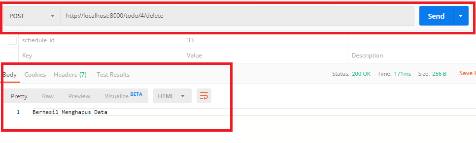

# **Writing Week 7 (Backend Week 3)**

## **Sequelize**
<div align='justify'>Untuk mempermudah interaksi dengan MySQL, dapat menggunakan Sequelize. Sequelize adalah ORM database untuk mempermudah pemetaan database entry menjadi object, sehingga akan mempercepat dan mempermudah proses interaksi dengan database. 

1. ### **Install dan init Sequelize & Sequelize Cli**, 
    Tools command line atau cli yang dapat kita gunakan melalui terminal untuk menggenerate sequelize, maka Sequelize cli harus diinstall terlebih dahulu dengan cara.
    ```
    npm i -g sequelize-cli
    
    npm i sequelize

    sequelize init
    ```
    setelah melakukan init Maka akan menghasilkan folder seeders, models, dan config.

2. ### **Koneksi Database**, 
    Database yang digunakan adalah MySQL, untuk menjalankan mysql, sequelize membutuhkan library tambahan yaitu mysql2
    ```
    npm i mysql2
    ```
    sehingga dependencies pada file package.json :
    ```javascript
    "dependencies": {
        "express": "^4.17.1",
        "mysql2": "^2.1.0",
        "sequelize": "^5.21.3"
    }
    ```
    Konfigurasi database dengan membuka file config.json dan sesuaikan dengan MySql
    ```javascript
    {
        "development": {
            "username": "root",
            "password": "",
            "database": "simple_database",
            "host": "127.0.0.1",
            "dialect": "mysql",
            "operatorsAliases": false
        },
        "test": {
            "username": "root",
            "password": null,
            "database": "database_test",
            "host": "127.0.0.1",
            "dialect": "mysql",
            "operatorsAliases": false
        },
        "production": {
            "username": "root",
            "password": null,
            "database": "database_production",
            "host": "127.0.0.1",
            "dialect": "mysql",
            "operatorsAliases": false
        }
    }
    ```
    Sesuai dengan file config.json, buat database dengan nama simple_database.

3. ### **Membuat Model**, 
    Setelah database dibuat, pindah ke terminal untuk membuat Model, pada contoh ini nama model yang kita buat adalah User.
    ```
    sequelize-cli model:generate --name User --attributes name:string,label:string,picture:string,email:string,phone:string,website:string,summary:string
    ```
    Akan menghasilkan file dengan nama user.js pada folder model yang hasilnya seperti berikut :
    ```javascript
    "use strict";
    module.exports = (sequelize, DataTypes) => {
        const User = sequelize.define(
            "User",
            {
                name: DataTypes.STRING,
                label: DataTypes.STRING,
                picture: DataTypes.STRING,
                email: DataTypes.STRING,
                phone: DataTypes.STRING,
                website: DataTypes.STRING,
                summary: DataTypes.STRING,
            },
            {}
        );
        User.associate = function (models) {
            // associations can be defined here
        };
        return User;
    };
    ```

4. ### **Migrate Model**, 
    Model yang telah dibuat, hanya sebtas file saja. Untuk mengubah file model ke tabel pada database maka lakukan migrate db dengan perintah berikut:
    ```
    sequelize-cli db:migrate
    ```

5. ### **Integrasi Route & Controller**, 
    Buatlah file route pada folder routes dengan nama user.router.js yang isinya seperti berikut:
    ```javascript
    const router = require("express").Router();
    const userController = require("../controller/user.controller.js");

    router.post("/", userController.createUser);
    router.get("/", userController.readUser);
    router.put("/:id", userController.updateUser);
    router.delete("/:id", userController.deleteUser);

    module.exports = router;
    ```
    Buatlah file pada folder controller dengan nama user.controller.js yang isinya seperti berikut:
    ```javascript
    const model = require("../models");

    function createUser(req, res) {}

    function readUser(req, res) {}

    function updateUser(req, res) {}

    function deleteUser(req, res) {}

    module.exports = {
        createUser,
        readUser,
        updateUser,
        deleteUser,
    };
    ```

6. ### **Create**, 
    Create yang berarti menambahkan data baru ke database. Untuk menambahkan data baru, modifikasi function createUser menjadi :
    ```javascript
    function createUser(req, res) {
        model.User.create({
            name: req.body.name,
            label: req.body.label,
            picture: req.body.picture,
            email: req.body.email,
            phone: req.body.phone,
            website: req.body.website,
            summary: req.body.summary,
        })
            .then(function (result) {
                res.json(result);
            })
            .catch(function (error) {
                res.json({ error: error });
            });
    }
    ```
    req.body diambil dari data body sesuai dengan fieldnya yang dikirimkan oleh thunder client atau pada web nyata adalah dari form input. Ini akan berfungsi jika pada server kita beri middleware untuk menghandle nya.
    ubah file index.js seperti berikut :
    ```javascript
    const express = require("express");
    const app = express();
    const router = require("./routes/router.js");

    app.use(express.urlencoded({ extended: true }));
    app.use("/", router);

    app.listen(5000, function () {
        console.log(`Server running on http://localhost:5000`);
    });
    module.exports = app;
    ```

7. ### **Read**, 
    membaca atau menarik data dari database. Langsung saja ubah function readUser menjadi seperti berikut:
    ```javascript
    function readUser(req, res) {
        model.User.findAll()
            .then(function (result) {
                res.json(result);
            })
            .catch(function (error) {
                res.json({ error: error });
            });
    }
    ```

8. ### **Update**, 
    mengubah data yang sudah tersimpan dengan data yang baru.Ubah function updateUser menjadi seperti berikut:
    ```javascript
    function updateUser(req, res) {
         model.User.update(
            {
                name: req.body.name,
                label: req.body.label,
                picture: req.body.picture,
                email: req.body.email,
                phone: req.body.phone,
                website: req.body.website,
                summary: req.body.summary,
            },
            {
                where: {
                    id: req.params.id,
                },
            }
        )
            .then(function (result) {
                res.json(result);
            })
            .catch(function (error) {
                res.json({ error: error });
            });
    }
    ```

9. ### **Delete**, 
    Untuk menghapus data maka ubah function deleteUser sehingga menjadi berikut:
    ```javascript
    function deleteUser(req, res) {
        model.User.destroy({
            where: {
                id: req.params.id,
            },
        })
            .then(function (result) {
                res.json(result);
            })
            .catch(function (error) {
                res.json({ error: error });
            });
    }
    ```

&nbsp;

## **Intro MongoDB**
<div align = 'justify'>MongoDB adalah open-source database yang menggunakan document-oriented data model dan non-structured query language. sebagai salah satu sistem dan database NoSQL (Not only SQL) yang paling mutakhir saat ini. Karena kapasitasnya, MongoDB dapat digunakan untuk menyimpan volume data yang besar. MongoDB dapat memahami banyak bahasa pemrograman yang populer. Database ini menyimpan data dalam dokumen mirip JSON dengan schema dinamis. Dengan sistem ini, bisa menyimpan data tanpa perlu memikirkan struktur datanya. 

### **Fitur-Fitur MongoDB :**

- **Schema-less database**,  (database tanpa schema) berarti satu kumpulan atau koleksi data bisa memiliki beberapa tipe dokumen di dalamnya. Dokumen ini bisa mengandung banyak konten dalam berbagai ukuran. Fitur ini lah yang membuat MongoDB menjadi program database yang fleksibel.
- **Document-oriented**, MongoDB adalah database yang berorientasi pada dokumen. Data apa pun yang disimpan di dalam MongoDB itu berbentuk dokumen, bukan tabel. Dalam dokumen-dokumen tersebut, data disimpan dalam field, bukan baris atau kolom. Hal ini juga yang mendukung fleksibilitas MongoDB.
- **Indexing**, Di database MongoDB, semua field dalam dokumen di-indeks berdasarkan indeks primer dan sekunder. untuk membuat pencarian dan pengambilan data yang tersimpan di MongoDB itu lebih mudah dan cepat.
- **Skalabilitas**, MongoDB menyediakan fitur horizontal scalability dengan sharding. Sharding adalah distribusi data dengan beberapa server berbeda. Dengan cara ini, data dalam jumlah besar dibagi menjadi beberapa kelompok yang lebih kecil menggunakan shard key. Kemudian, kelompok data ini dibagikan ke beberapa server fisik yang berbeda.
- **Replikasi**, fitur MongoDB yang mampu membuat salinan data dan mengirimnya ke server yang berbeda-beda. Jadi, jika salah satu server mengalami kerusakan atau masalah, data akan tetap aman karena tersimpan salinannya di server lain.

### **Kelebihan MongoDB**
tidak perlu mendesain schema database sendiri. Keuntungan lainnya menggunakan program database ini adalah fleksibilitasnya yang tinggi. Tidak hanya sangat fleksibel, juga bisa menyimpan data yang bersifat heterogen di MongoDB. MongoDB pun bisa terintegrasi dengan mudah untuk keperluan pengolahan big data lainnya.

### **Kekurangan MongoDB**
membutuhkan memory storage yang besar, Kekurangan lainnya adalah idak bisa menyimpan data lebih besar dari 16 MB di dalam setiap dokumen. Lalu, juga tidak diperbolehkan untuk melakukan nesting data lebih dari 100 level.

### **Desain Skema Database MongoDB**

1. **One to few**, Contoh yang mewakili relasi satu ke sedikit adalah relasi antara `Person` dan `Address`. Ini merupakan contoh yang bagus untuk diterapkan teknik embedded. dapat menyimpan data Address berupa array dan menyematkannya ke dalam object Person.

    

2. **One to many**, Contoh yang mewakili relasi satu ke banyak adalah relasi antara Product dan Part. Satu product akan memiliki banyak part. Lebih detil nya satu product akan memiliki ratusan part akan tetapi satu product tidak memiliki sampai jutaan part. Ini merupakan contoh yang bagus untuk terapkan teknik referensi. Bisa menyimpan data part dalam bentuk array berupa object id dari part-part dan menempatkannya ke dalam product.

    
    


    Dengan demikian, untuk mendapatkan data-data Part dari sebuah Product, kita harus melakukan query dua kali

    

3. **One to squillions**, Contoh yang mewakili relasi satu ke squillions adalah system log. System log akan menampung log system dari berbagai mesin atau server. Contoh lebih detail seperti Sentry atau Cloud Watch. Ini juga merupakan contoh klasik dari relasi parent-referensi dengan memiliki dokumen tersendiri untuk data host (server) dan dokumen log-message yang memiliki host id dokumen. Jadi pada satu data log message memiliki satu data host id.

    
    

4. **Referensi Dua Arah**, Untuk kasus-kasus tertentu, terkadang membutuhkan relasi dari dua sisi. Baik itu dari sisi satu ke N ataupun dari sisi N ke satu. Untuk dapat melalukanya maka harus mengunakan teknik referensi dari dua arah. Misalkan, pada Obeject Person memiliki sekumpulan data Task yang dimiliki salah satu object dalam dokumen Person. Dengan pemodelan satu ke banyak yang telah dijelaskan, ketika get person akan mendapatkan data orang berserta kumpulan task id. Apabila ingin mencari suatu task dimiliki oleh object person tertentu maka harus membuat referesi balik dengan menambahkan object Task pada dokumen Person. Dengan demikian, dokumen person dan task skemanya menjadi sebagai berikut.

    
    

### **Perbandingan Mongodb dan RDBMS Atribute**


&nbsp;

## **Web Server with Express & Mongoose**
<div align='Justify'>Mongoose adalah sebuah module pada NodeJS yang di install menggunakan npm, berfungsi sebagai penghubung antara NodeJS dan database nosql MongoDB. Mongoose menyediakan feature diantaranya, model data application berbasis Schema. Dan juga termasuk built-in type casting, validation, query building, business logic hooks dan masih banyak lagi yang menjadi ke andalan mongoose.

- **install Mongoose**, Buka terminal arahkan terminal ke directory project, lalu untuk Install MongoDB gunakan command berikut pada terminal ` $ npm install mongoose`. setelah menginstall mongoose dengan npm, directory project akan membuat sebuah folder baru bernama node_module, yang berisi folder mongoose.

    - Buat sebuah file javascript dalam project directory, dan beri nama server.js. Setelah itu buka file server.js lalu load module mongoose.
    ```javascript
    const mongoose = require('mongoose');
    ```
- **Koneksi ke database MongoDB**, menyalakan terlebih dahulu MongoDB Caranya buka tab baru pada terminal lalu ketik `mongod` dan `enter`. Jika terdapat tulisan `waiting for connections on port 2707` itu artinya database MongoDB sudah siap. Untuk contoh kasus menggunakan object mobil, 
    - Untuk mengakses database MongoDB dengan mongoose, maka tuliskan kode berikut ini pada server.js.
        ```javascript
        mongoose.connect('mongodb://localhost/mobil');
        ```
        merupakan sebuah url untuk mengakses database MongoDB. Dan yang mana url ini pun dapat di ubah jika kita memiliki data di luar sana selain MongoDB. Mobil adalah database yang akan di gunakan oleh mongoose, jika database mobil belum ada, maka mongose akan otomatis menambahkan database tersebut.
    - test koneksi dengan sebuah notifikasi gagal atau suksesnya pada console terminal. Tambahkan kode berikut pada file server.js kita.
        ```javascript
        const db = mongoose.connection 
        db.on('error', console.error.bind(console, 'connection error:')); 
        db.once('open', function() { 
            console.log('connection success'); 
        });
        ```
        mengkoneksikan project kita ke MongoDB melalui module mongoose. Berikut adalah kode lengkapnya.
        ```javascript
        const mongoose = require('mongoose');
        mongoose.connect('mongodb://localhost/mobil');
        const db = mongoose.connection
        db.on('error', console.error.bind(console, 'connection error:'));
        db.once('open', function() { 
            console.log('connection success'); 
        });
        ```
- **Schema & Model**, Setiap konfigurasi menggunakan Mongoose harus di sertai dengan Schema. Schema merupakan mapping dari MongoDB collection dan definisi dari type data yang di gunakan pada setiap object dalam collection.

    - Sedangkan model merupakan sebuah konstruktor compiled yang berasal dari Schema yang sudah kita definisikan.
    - Menulis kode untuk Schema, buat data collection mobil pada database MongoDB. Data ini terdiri dari nama, merk, tahun pembuatan, tanggal update, dan transmisi.
        ```javascript
        const mobilSchema = mongoose.Schema({ 
            nama: String, 
            merk: String, 
            tahunPembuatan: Number, 
            tanggalUpdate: Date, 
            transmisi: { 
                manual: Boolean, 
                outomatic: Boolean 
            } 
        });
        ```
        beri nama Schema dengan mobilSchema yang menginisiasi object Schema() dari mongoose. Dan memberi type data pada setiap field. MongoDB dan Mongoose dapat mendukung type data, String, Number, Date, Buffer, Boolean, Mixed, ObjectId, dan Array.
    - Setelah itu buat sebuah model dengan nama Mobil.
        ```javascript
        const Mobil = mongoose.model('Mobil', mobilSchema);
        ```
        Nantinya collection akan bernama mobils, yang di ambil Mobil dari parameter pertama function model. Saat ini kode akan seperti berikut :
        ```javascript
        const mongoose = require('mongoose'); 
        mongoose.connect('mongodb://localhost/mobil');
        const db = mongoose.connection
        db.on('error', console.error.bind(console, 'connection error:'));
        db.once('open', function() { 
            console.log('connection success'); 
        }); 
        const mobilSchema = mongoose.Schema({ 
            nama: String, 
            merk: String, 
            tahunPembuatan: Number, 
            tanggalUpdate: Date, 
            transmisi: { 
                manual: Boolean, 
                outomatic: Boolean 
            } 
        }); 
        const Mobil = mongoose.model('Mobil', mobilSchema);
        ```
- **Menyimpan Data ke Database**, membuat sebuah variabel yang berisi sebuah object yang berasal dari Schema yang sudah dibuat.
    - tambah kan kode berikut pada file server.js
        ```javascript
        const lamborgini = new Mobil({ 
            nama: 'Aventador', 
            merk: 'Lamborgini', 
            tahunPembuatan: 2015, 
            tanggalUpdate: new Date(), 
            transmisi: { 
                manual: true, 
                outomatic: false 
            } 
        });
        ```
    - Buat kode menggunakan function save() dari mongoose untuk menyimpan data kedalam database.
        ```javascript
        lamborgini.save(function(err) { 
            if (err) { 
                console.log(err); 
            } else { 
                console.log('berhasil menyimpan'); 
            } 
        });
        ```
    - Buka terminal dan buka tab baru dan ketik command `mongo` setelah itu perisa semua database dengan perintah `show dbs`.
        Bertambah satu database bernama mobil sesuai dengan setup konfigurasi yang sudah dilakukan.

        Ketik command `use mobil` ketika ingin menggunakan database ini. Masukan perintah `show collections` untuk melihat semua collections pada database tersebut. Kita baru menambahkan satu collection yaitu `mobils`.
        
        Untuk melihat data yang sudah tersimpan pada collections `mobils` ketikan perintah berikut pada terminal
        ```javascript
        db.mobils.find().pretty()
        ```
        berhasil menyimpan data mobil lamborgini kita ke database. Berikut kode lengkapnya
        ```javascript
        const mongoose = require('mongoose'); mongoose.connect('mongodb://localhost/mobil'); 
        const db = mongoose.connection 
        db.on('error', console.error.bind(console, 'connection error:')); db.once('open', function() { 
            console.log('connection success'); 
        }); 
        const mobilSchema = mongoose.Schema({ 
            nama: String, 
            merk: String, 
            tahunPembuatan: Number, 
            tanggalUpdate: Date, 
            transmisi: { 
                manual: Boolean, 
                outomatic: Boolean 
            } 
        }); 
        const Mobil = mongoose.model('Mobil', mobilSchema); 
        const lamborgini = new Mobil({ 
            nama: 'Aventador', 
            merk: 'Lamborgini', 
            tahunPembuatan: 2015, 
            tanggalUpdate: new Date(), 
            transmisi: { 
                manual: true, 
                outomatic: false 
            } 
        }); 
        console.log(lamborgini); 
        lamborgini.save(function(err) { 
            if (err) { 
                console.log(err); 
            } else { 
                console.log('berhasil menyimpan'); 
            } 
        });
        ```
- **Membaca data**, berhasil menyimpan data yang sudah dibuat, sekarang menampilkan data yang sudah di buat kedalam terminal
    - Ketikan kode berikut di dalam file server.js
        ```javascript
        Mobil.find(function (err, mobils) { 
            if (err) return console.error(err); 
            console.log(mobils); 
        })
        ```
        hapus dulu variable lamborgini yang berisi object data, dan function save karena sudah tidak ingin menyimpan datanya untuk yang ke dua kali. kode lengkapnya menjadi seperti ini
        ```javascript
        const mongoose = require('mongoose'); mongoose.connect('mongodb://localhost/mobil'); 
        const db = mongoose.connection 
        db.on('error', console.error.bind(console, 'connection error:')); 
        db.once('open', function() { 
            console.log('connection success'); 
        }); 
        const mobilSchema = mongoose.Schema({ 
            nama: String, 
            merk: String, 
            tahunPembuatan: Number, 
            tanggalUpdate: Date, 
            transmisi: { 
                manual: Boolean, 
                outomatic: Boolean 
            } 
        }); 
        const Mobil = mongoose.model('Mobil', mobilSchema);
        Mobil.find(function (err, mobils) { 
            if (err) 
                return console.error(err); 
            console.log(mobils); 
        })
        ```
    - Dengan method find() memungkinkan untuk menampilkan semua data yang ada di dalam database.

    Mongoose mendukung query yang sangat lengkap. Untuk menampilkan data sesuai Id bisa menggunaka function findById(), atau jika menampilkan data sesuai field bisa menggunakan findOne().

    - **Find By Id**
        ```javascript
        Model.findById(obj._id, function (err, doc){ 
            // doc is a Document 
        });
        ```
    - **Find One**
        ```javascript
        Model.findById(obj._id, function (err, doc){ 
            // doc is a Document 
        });
        ```
- **Custom Method**, Mongoose memberikan keleluasaan dalam membuat method sendiri yang dapat di gunakan pada project.
    - Berikut contoh custom method pada mongoose.
        ```javascript
        mobilSchema.methods.custom = function() { 
            const lamborgini = this.nama ? "Nama mobil adalah " + this.nama : "Mobil tak punya nama"; 
            console.log(lamborgini); 
        }
        ```
    Custom method harus di definisikan sebelum model.

    - Cara mengaksesnya dengan memanggil method tersebut. Berikut contoh dengan membuat sebuat object data yang ingin tampilkan di dalam terminal dengan menggunakan custom method. Tambahkan kode :
        ```javascript
        const car = new Mobil({ nama: 'Ferarri' }); 
        car.custom();
        ```
    Sehingga kode lengkapnya menjadi seperti ini
    ```javascript
    const mongoose = require('mongoose'); mongoose.connect('mongodb://localhost/mobil'); 
    const db = mongoose.connection 
    db.on('error', console.error.bind(console, 'connection error:')); db.once('open', function() { 
        console.log('connection success'); 
    }); 
    const mobilSchema = mongoose.Schema({ 
        nama: String, 
        merk: String, 
        tahunPembuatan: Number, 
        tanggalUpdate: Date, 
        transmisi: { 
            manual: Boolean, 
            outomatic: Boolean 
        } 
    }); 
    mobilSchema.methods.custom = function() { 
        const lamborgini = this.nama ? "Nama mobil adalah " + this.nama : "Mobil tak punya nama"; 
        console.log(lamborgini); 
    } 
    const Mobil = mongoose.model('Mobil', mobilSchema);
    const car = new Mobil({ nama: 'Ferarri' });
    car.custom();

    // output : Nama mobil adalah Ferarri
    ```
    
&nbsp;

## **Container & Docker**
<div align='justify'>Docker adalah aplikasi untuk menyatukan berbagai file software dan pendukungnya dalam sebuah wadah (container) agar memudahkan proses pengembangan software. 

Dalam pengembangan aplikasi, developer memerlukan virtualisasi di server agar aplikasi bisa berjalan di berbagai platform dengan konfigurasi hardware yang berbeda-beda. Sayangnya, ketika menggunakan virtualisasi, harus menyiapkan satu sistem operasi secara penuh. Jika membutuhkan beberapa virtualisasi, server perlu resource yang besar.

container bisa digunakan sebagai alternatif virtualisasi sehingga tidak perlu menyiapkan sistem operasi secara penuh. Dengan container, ukuran file menjadi lebih kecil dibandingkan virtualisasi yang biasa digunakan.

### **Fungsi**
1. **Mempermudah Pengembangan Aplikasi**, Docker bisa mempermudah pekerjaan developer ketika mengembangkan aplikasi. Alasannya, Docker lebih hemat resource dan mampu menyediakan environment yang stabil untuk dijalankan di perangkat apapun, mulai dari cloud server hingga komputer pribadi.
2. **Menyederhanakan Konfigurasi**, Docker tidak memiliki overhead sehingga developer bisa menjalankan aplikasi yang diuji tanpa konfigurasi tambahan.
3. **Memudahkan Pengembangan Kode Pipeline**, Developer bisa memanfaatkan Docker container sebagai tempat pengujian kode Pipeline beserta tools yang diperlukan dengan lebih mudah.
4. **Bisa Digunakan untuk Debugging**, Adanya fitur debug bisa membantu developer untuk mengatasi masalah pada aplikasi tanpa perlu bersusah payah meninggalkan environment di Docker.
5. **Mendukung Multitenancy**, Docker cocok digunakan untuk membuat aplikasi berstruktur multitenance seperti Software as a Service (SaaS). Anda bisa membuat lebih dari satu environment yang terisolasi dan menjalankan objek aplikasi untuk setiap tenant.
6. **Meningkatkan Sumber Daya dengan Cepat**, peningkatan sumber daya perangkat dapat dilakukan dengan cepat sehingga durasi pengembangan software  lebih singkat.

### **Docker Terms**
- **Docker image** — Kumpulan file yang menunjang sebuah aplikasi.
- **Docker container** — Wadah untuk mengemas dan menjalankan aplikasi. Wadah ini mencakup kode, runtime, system tools, dan pengaturan. Container hanya bisa mengakses resource yang telah ditentukan dalam Docker image.
- **Docker client** — Tempat di mana pengguna dapat mengirimkan perintah seperti Docker build, Docker pull, dan Docker run kepada Docker daemon.
- **Docker Engine Rest API** — Komponen yang digunakan untuk berinteraksi dengan Docker daemon. Komponen ini bisa diakses klien melalui HTTP.
- **Docker daemon** — Proses pengelolaan Docker images, container, network, dan storage volumes. Docker daemon menerima request dari Docker API dan akan memprosesnya.
- **Docker host** — Komponen yang menyediakan lingkungan untuk menjalankan aplikasi. Docker host bertanggung jawab menerima perintah yang diberikan Docker client.
- **Docker registry** — Wadah untuk menyimpan Docker image. Docker image akan memberi reaksi sesuai perintah yang diberikan. Misalnya, saat diberi perintah docker push, docker image akan didorong atau dibagikan ke registry Docker Hub.
- **Docker Hub** — Layanan yang disediakan untuk menemukan dan berbagi Docker image.

### **Docker Command in Terminal**
- **Contoh : Setup Container Mongo pada Docker**
    1. Download image untuk mongo `$ docker pull mongo`
    2. Periksa apakah image sudah ter-download `$ docker images`
    3. Buat kontainer untuk mongo `$ docker container create --name mongoserver1 -p 1000:27017 mongo`
    4. Periksa apakah kontainer sudah terbuat `$ docker container ls -a`
    5. Jalankan kontainer mongo `$ docker container start mongoserver1`
    6. periksa apakah kontainer mongo sudah jalan `$ docker container ls`
    7. Untuk masuk ke kontainer mongo dapat menggunakan perintah:
        ```
        $ docker exec -it mongoserver1 bash
        $ mongo
        ```
    8. Untuk mengakses mongo dari host `$ mongo --port 2000`

- **Contoh : Setup Container Mysql Server pada Docker**
    1. Download image untuk mysql-server. `$ docker pull mysql/mysql-server`
    2. Periksa apakah image sudah ter-download `$ docker images`
    3. Buat kontainer untuk mysql-server dan langsung jalankan `$ docker run -d --name mysqlserver1 -p 5000:3306 mysql/mysql-server`
    4. Periksa apakah kontainer sudah jalan `$ docker container ls`
    5. Periksa log pada container mysql-server untuk melihat password yang di-generate `$ docker logs mysqlserver1 | grep GENERATED`
    6. Untuk masuk ke kontainer mysql dapat menggunakan perintah: `$ docker exec -it mysqlserver1 bash`
    7. Masuk ke mysql `$ mysql -u root -p (gunakan password yang di generate)`
    8. Ganti password mysql `$ ALTER USER 'root'@'localhost' IDENTIFIED BY 'newpass';`
    9. Buat user baru mysql `$ CREATE USER 'newuser'@'%' IDENTIFIED BY 'newpass';`
    10. Berikan akses pada user agar dapat diakses dari luar atau host `GRANT ALL PRIVILEGES ON *.* TO 'newuser'@'%' WITH GRANT OPTION`
    11. Untuk mengakses mysql-server dari host: `$ mysql -h localhost -P 1234 --protocol=tcp -u root -p`

### **Dockerfile**
<div align= 'justify'>Dockerfile adalah sebuah file yang digunakan untuk membuat container image. sedangkan Docker Hub merupakan registry tempat penyimpanan docker image. Setelah membuat custom image dengan nama yang diinginkan, selanjutnya adalah bisa push image tersebut ke registry, salah satunya Docker Hub. Selanjutnya jika ingin menggunakan image tersebut, anda hanya perlu pull image tersebut ke server dari Docker Hub.

- **Dockerfile Commands**, 
    - Perintah **ADD** digunakan untuk mengcopy file dari suatu direktori ke direktori tujuan. Jika direktori asal adalah sebuah URL, perintah add akan mendownloadnya dan menempatkannya ke direktori tujuan.
    - **CMD** hampir sama dengan perintah RUN, CMD digunakan untuk mengeksekusi perintah yang lebih spesifik, seperti pada saat proses pembuatan container pada image.
    - **ENTRYPOINT** adalah argumen untuk mengeset default aplikasi yang digunakan setiap kali sebuah container dibuat menggunakan image.
    - **ENV** digunakan untuk mengeset environment variables
    - **FROM** argument mendefinisikan sebuah base image yang akan digunakan untuk memulai membangun proses pada setiap docker image apakah itu di repositori ataupun di host sendiri.
    - **WORKDIR** direktif digunakan untuk mengatur di mana perintah didefinisikan dengan CMD yang akan dieksekusi.
    - **RUN** adalah perintah yang digunakan untuk membangun docker images yang terpusat untuk mengeksekusi Dockerfiles.
    - **MAINTAINER** adalah perintah yang tidak dijalankan tetapi di deklarasikan sebagai author field dari images.
    - **USER** direktif digunakan untuk mengatur UID (atau nama pengguna) yang menjalankan sebuah container berdasarkan dari image yang sedang dibangun.
    - Perintah **VOLUME** digunakan untuk mengaktifkan akses dari kontainer e direktori pada mesin host.
    - **EXPOSE** digunakan untuk menghubungkan port tertentu untuk mengaktifkan network antara proses yang berjalan di dalam container dan mesin host.


### **Docker Compose**
<div align = 'justify'>Docker-Compose adalah alat untuk mendefinisikan dan menjalankan satu atau beberapa container yang saling terkait dengan sebuah command. Pada implementasinya dapat menggunakannya dengan membuat sebuah file berekstensi yaml/yml yang di dalamnya terdapat konfigurasi-konfigurasi terhadap service aplikasi yang akan dijalankan. Gambaran sederhananya seperti menyatukan semua Dockerfile dari setiap service aplikasi ke dalam sebuah file yaml (docker-compose file), dan selanjutnya dengan sebuah command, bisa meng-create dan men-start semua service yang telah didefinisikan pada file yml tersebut. script konfigurasi nya juga sangat mudah dan mirip dengan argumen-argumen saat ingin menjalankan sebuah Dockerfile. bisa menggunakannya di semua lingkungan kerja : production, staging, development, dan testing. 

- **instalasi**, Docker compose berjalan diatas docker engine, setelah menginstall docker (otomatis ada docker engine) terlebih dahulu dan sesuaikan dengan sistem operasi yang dimiliki. Jika OS adalah Mac atau Windows dan telah menginstall Docker Desktop / Docker Toolbox (untuk Windows 10 Home dan Edition ke bawah), maka docker-compose sudah terdapat di dalamnya.

- **Proses Dasar Penggunaan Docker-Compose**
    1. Mendefinisikan environment aplikasi dengan membuat `Dockerfile` sehingga bisa digunakan kembali dimana saja.
    2. Mendefinisikan service lainnya di dalam `docker-compose.yml` sehingga semuanya bisa berjalan bersamaan dalam environment yang terisolasi.
    3. Jalankan command docker compose yaitu : `docker-compose build` dan `docker-compose up` melalui command prompt/shell (pastikan berada pada path yang sama dengan posisi file docker-compose.yml).

- **Docker compose command**, command (perintah) yang bisa dijalankan melalui docker-compose untuk mengelola keseluruhan service yang telah didefinisikan. Berikut adalah command docker compose yang biasa digunakan : format : `docker-compose [command]`
    1. `docker-compose build` : digunakan untuk mem-build semua service yang telah didefinisikan pada docker-compose.yml, output dari command ini adalah image per service yang siap untuk dijalankan pada sebuah container. Default nama image yang dihasilkan adalah 
    
    *[namafolder-posisi-file_docker-compose.yml]_[nama_service]* misal jika file docker-compose.yml yang memiliki *service: web* berada di dalam *folder project*, maka nama image yang dihasilkan adalah *project_web*.

    2. `docker-compose up` : digunakan untuk menjalankan semua image yang telah di-build ( `docker-compose build` ), jika tidak terjadi masalah maka image tersebut menjadi running container sedangkan jika terdapat masalah maka biasanya akan terbentuk container yang posisinya berhenti/stop. Default nama container jika tidak didefinsikan adalah sama dengan nama imagenya.

    3. `docker-compose down` : Menghentikan (stop) semua container dan me-remove nya (ingat stop tidak otomatis remove) semua container, networks, volumes, dan images yang dihasilkan oleh perintah `up`.

    4. `docker-compose logs` : command ini penting jika ingin melihat apa yg terjadi pada service tertentu saat dijalankan dalam container. Biasa digunakan untuk mendeteksi error atau melihat kondisi/respon yang terjadi pada service tertentu.

    5. `docker-compose config` : digunakan untuk mengecek apakah script yang ada pada file docker-compose.yml yang telah buat sudah valid atau sudah sesuai dengan referensi dari docker-compose. Output dari command ini akan memberikan pesan error (jika error) atau jika berhasil hanya menampilkan print out semua script yg ada di docker-compose.yml.

&nbsp;

## **Testing API with Postman**
<div align= 'justify'>sebuah aplikasi yang berfungsi sebagai REST Client untuk uji coba REST API. Postman biasa digunakan oleh developer pembuat API sebagai tools untuk menguji API yang telah mereka buat. Postman merupakan tool untuk melakukan proses development API, untuk saat ini sudah banyak fitur-fitur yang sangat membantu dalam proses development API, diantaranya :

1. **Collection**, Pengelompokan request API yang bisa disimpan atau diatur dalam bentuk folder. Memudahkan untuk pengelompokan request sesuai dengan proyek yang di kerjakan.
2. **Environment**, Semacam config untuk menyimpan attribute dan attribute tersebut dapat digunakan ataupun dimanipulasi dalam proses request API.
3. **Response**, Developer dapat membuat Mockup API sebelum benar-benar mengimplementasikan ke dalam proyek.
4. **Mock Server**, Dengan fitur ini, Mockup API yang dibuat menggunakan fitur “example response” dapat diakses dari internet layaknya Mockup API tersebut sudah di implementasikan dan di deploy ke server.
5. **Script Test**, Fitur untuk melakukan validasi respon, termasuk di dalamnya menuliskan test sesuai dengan kebutuhan.
6. **Automated Test (Runner)**, Menjalakan request dalam satu collection secara otomatis, dengan menggunakan script test.

### **Testing API & Documentation**
<div align="justify">Misal sudah ada endpoint untuk melaksanakan proses crud seperti berikut pada express:
```javascript
app.get('/todo', getAllTodos);
app.get('/todo/:id', getTodoById);
app.post('/todo/save', addTodos);
app.put('/todo/:id/update', updateTodos);
app.delete('/todo/:id/delete', deleteTodos);
```

1. **Menampilkan Seluruh Data**

    

2. **Menampilkan Data Dengan ID Tertentu**

    

3. **Menambahkan Data**

    

4. **Memperbaharui Data**

    

5. **Menghapus Data**

    